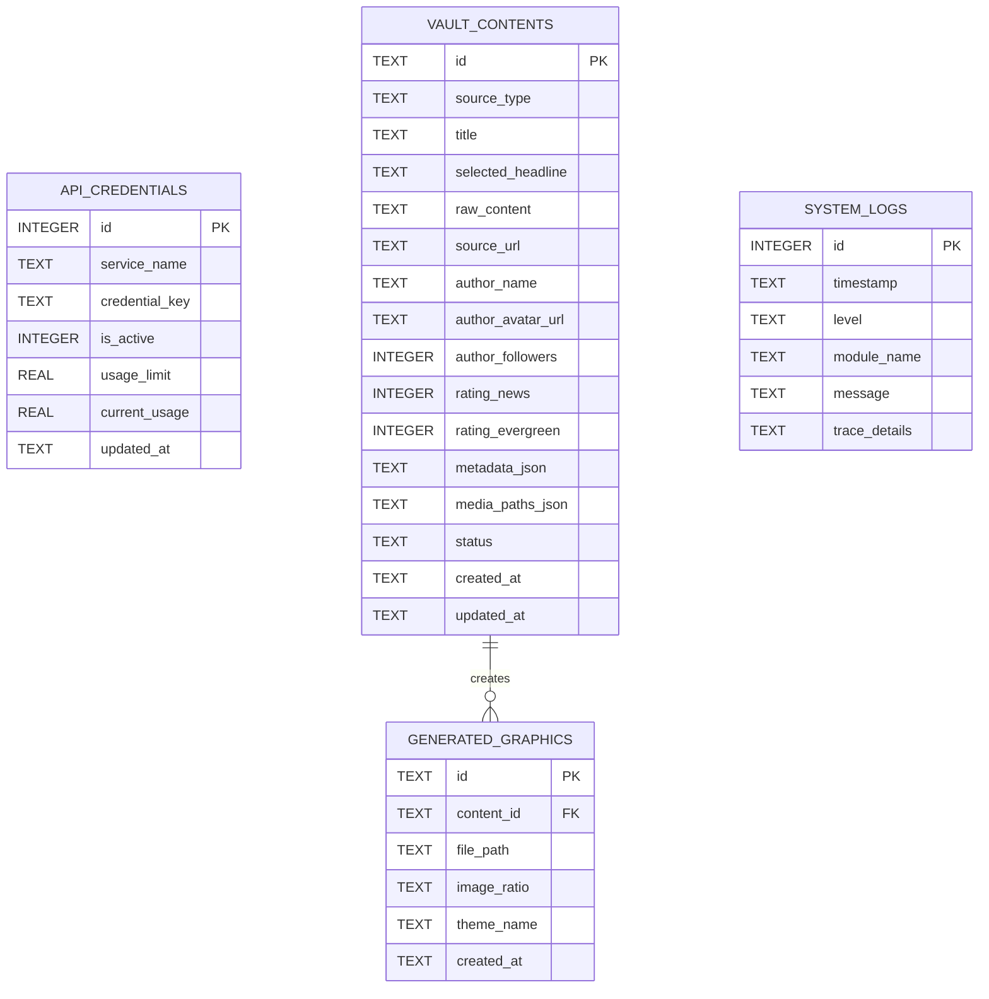

# 00. แผนผังฐานข้อมูลและสัญญากลางระบบ (Database & External Root Specification)

เอกสารฉบับนี้คือ **ข้อกำหนดคุณลักษณะเชิงเทคนิค (Technical Specification)** สำหรับสร้างระบบคลังฐานข้อมูล และส่วนการกักเก็บ Asset ภายนอกเครื่อง ร่วมกับระบบบริหารจัดการ API Key กลาง และมาตรฐานการทำ Logging เพื่อการทำงานร่วมกันอย่างเป็นระบบ เสถียร และไม่หนักตัวเครื่องแอปพลิเคชันหลัก

---

## 1. การกำหนดตำแหน่ง Root โฟลเดอร์ภายนอกเครื่อง (External Root Folder Architecture)

เพื่อแก้ปัญหาพื้นที่เก็บข้อมูลในโฟลเดอร์หลักของโปรแกรมบวมน้ำ (จากไฟล์ภาพนิ่ง วิดีโอสกัด และฐานข้อมูล SQLite) ระบบ V2 จะต้องบังคับให้มีขั้นตอน **"ตั้งค่าพิกัดภายนอกเครื่องในการรันครั้งแรก" (First-Run External Root Setup)**

### 1.1 โครงสร้างโฟลเดอร์ใต้พิกัดภายนอก (Vault Directory Structure)
เมื่อผู้ใช้ระบุหรือกำหนดโฟลเดอร์หลัก เช่น `/Volumes/ExternalSSD/ContentVault_V2/` ตัวโปรแกรมจะต้องตรวจสอบและสร้างโครงสร้างย่อยแบบนี้โดยอัตโนมัติ:

```text
[External Root Directory] /
├── databases/
│   └── content_pool.db            # ไฟล์ฐานข้อมูล SQLite กลาง
├── downloaded_media/
│   ├── competitor_assets/         # ภาพดิบที่ดาวน์โหลดมาจากเฟส/ติ๊กต็อกคู่แข่ง
│   ├── youtube_frames/            # ภาพนิ่งที่แคปเจอร์มาจากคลิป YouTube แยกเป็นโฟลเดอร์รหัสคลิป
│   └── author_logos/              # รูปโลโก้/อวาตาร์ของช่องหรือเพจผู้ผลิต
├── generated_graphics/
│   └── pillow_renders/            # รูปภาพกราฟิกโปสเตอร์ที่ Pillow วาดเสร็จแล้วพร้อมใช้งาน
└── exports_csv/
    └── deep_research/             # ไฟล์ CSV สรุปผลวิจัยลึกของคู่แข่ง
```

---

## 2. โครงสร้างฐานข้อมูลส่วนกลาง SQLite (Database Schema)

ระบบจะใช้ไฟล์ฐานข้อมูลเดี่ยว `databases/content_pool.db` เป็นตัวกลางประสานงานสถานะและความคืบหน้าของคอนเทนต์ทั้งหมด (Single Source of Truth)



### 2.1 รายละเอียดตาราง (Table Specifications)

#### ตารางที่ 1: `vault_contents` (คลังเก็บวัตถุดิบและเนื้อหาจากการค้นหา)
ตารางศูนย์กลางที่ใช้รองรับเนื้อหาจากทุกแหล่งค้นหาและส่งต่อให้ระบบสร้างภาพโพส

| ชื่อฟิลด์ (Field Name) | ประเภทข้อมูล | เงื่อนไข (Constraints) | คำอธิบายรายละเอียด |
| :--- | :--- | :--- | :--- |
| `id` | TEXT | PRIMARY KEY | รหัสอ้างอิงเฉพาะ (เช่น UUID หรือ Hash จาก URL) |
| `source_type` | TEXT | NOT NULL | แหล่งที่มา: `radar`, `rss`, `youtube`, `github` |
| `title` | TEXT | NOT NULL | ชื่อเรื่องหรือหัวข้อข่าวหลักของคอนเทนต์ |
| `selected_headline` | TEXT | - | พาดหัวภาษาไทยที่ AI เกลาเสร็จแล้ว หรือเตรียมส่งไปทำภาพโพสต์ |
| `raw_content` | TEXT | - | เนื้อหาเต็ม (สคริปต์พูด, README, เนื้อหาข่าวสแกน) |
| `source_url` | TEXT | NOT NULL | ลิงก์ตรงที่มาของคอนเทนต์ |
| `author_name` | TEXT | - | ชื่อผู้เขียน, เพจคู่แข่ง, หรือชื่อช่อง YouTube |
| `author_avatar_url` | TEXT | - | ลิงก์รูปโปรไฟล์/โลโก้ ของผู้ผลิตต้นทาง |
| `author_followers` | INTEGER | - | ยอดผู้ติดตามของเพจหรือช่อง ณ วันที่สแกน |
| `rating_news` | INTEGER | DEFAULT 0 | คะแนนความสดใหม่/ความไวรัล (1 - 10) ประเมินโดย AI |
| `rating_evergreen` | INTEGER | DEFAULT 0 | คะแนนความรู้ยั่งยืนไม่ตกเทรนด์ (1 - 10) ประเมินโดย AI |
| `metadata_json` | TEXT | - | ข้อมูลย่อยเพิ่มเติมในรูป JSON (เช่น Tags, VPH, Stars, issues) |
| `media_paths_json` | TEXT | - | อาร์เรย์ของพิกัดไฟล์รูปดิบ/รูปเฟรมที่บันทึกไว้ใน Root ภายนอก |
| `status` | TEXT | DEFAULT 'scraped' | สถานะการทำงาน: `scraped` -> `ready_for_design` -> `designed` -> `posted` |
| `created_at` | TEXT | NOT NULL | วันที่เวลาจัดทำคอนเทนต์ (ISO 8601 String) |
| `updated_at` | TEXT | NOT NULL | วันที่เวลาที่มีการแก้ไขข้อมูลล่าสุด (ISO 8601 String) |

#### ตารางที่ 2: `generated_graphics` (คลังเก็บภาพกราฟิกโปสเตอร์ที่วาดเสร็จ)
| ชื่อฟิลด์ (Field Name) | ประเภทข้อมูล | เงื่อนไข (Constraints) | คำอธิบายรายละเอียด |
| :--- | :--- | :--- | :--- |
| `id` | TEXT | PRIMARY KEY | รหัสเฉพาะรูปภาพภาพที่เสร็จสมบูรณ์ |
| `content_id` | TEXT | FOREIGN KEY | รหัสอ้างอิงตรงหาเนื้อหาตาราง `vault_contents` |
| `file_path` | TEXT | NOT NULL | พิกัดไฟล์รูปดิบบน External Storage |
| `image_ratio` | TEXT | NOT NULL | สัดส่วนของภาพ: `1:1`, `16:9`, `9:16` |
| `theme_name` | TEXT | - | ชื่อสไตล์ธีมสีที่ใช้ (เช่น `Neon Purple`, `Emerald Gold`) |
| `created_at` | TEXT | NOT NULL | วันที่และเวลากราฟิกถูกสร้างเสร็จ |

#### ตารางที่ 3: `api_credentials` (ศูนย์บริการจัดการ Key และโควตา)
| ชื่อฟิลด์ (Field Name) | ประเภทข้อมูล | เงื่อนไข (Constraints) | คำอธิบายรายละเอียด |
| :--- | :--- | :--- | :--- |
| `id` | INTEGER | PRIMARY KEY AUTOINCREMENT | ลำดับการกรอก |
| `service_name` | TEXT | NOT NULL | ชื่อบริการ: `openrouter`, `apify`, `github` |
| `credential_key` | TEXT | NOT NULL | ตัวคีย์ API ลับที่ใช้จริง |
| `is_active` | INTEGER | DEFAULT 1 (True) | สถานะเปิดปิดคีย์: 1 = พร้อมใช้, 0 = ถูกระงับ |
| `usage_limit` | REAL | DEFAULT 0 | ลิมิตความปลอดภัยด้านจำนวนเงิน (USD) หรือโควตา |
| `current_usage` | REAL | DEFAULT 0 | ยอดใช้จริงสะสมรายเดือน |
| `updated_at` | TEXT | NOT NULL | วันเวลาที่อัปเดตสถิติล่าสุด |

---

## 3. ระบบ API กลางและการจัดการกุญแจหมุนเวียน (Central API Manager & Key Rotation)

สคริปต์ย่อยทุกตัวที่จะเรียกหาปัญญาประดิษฐ์ (AI) หรือ Bot ดึงข้อมูล จะต้องห้ามฝัง API Key ไว้ในสคริปต์ตัวเอง แต่ต้องผ่านคลาส **`VaultCredentialManager`** เพื่อดึงกุญแจที่ยังใช้งานได้จริงจากตาราง `api_credentials`

### 3.1 ตรรกะการเลือกกุญแจและการกู้คืนกรณีฉุกเฉิน (Rotation & Fallback Logic)
1. **การดึงคีย์รัน:** คลาสจะคัดเลือกกุญแจที่มี `is_active = 1` และ `current_usage < usage_limit` (ถ้ามีการกำหนดลิมิตไว้)
2. **กรณี Key รั่ว/จำกัดสิทธิ์ (Rate Limit - 429):** สคริปต์จะจับ Error แล้วปิดคีย์เดิมชั่วคราว (`is_active = 0`) และนำส่งคีย์ถัดไป (Fallback Key Candidate) ออกไปทำงานแทนทันที
3. **การประเมินราคา:** หากเกิด Error "เครดิตไม่เพียงพอ (402)" ระบบจะแก้ไขสถานะคีย์นั้นใน DB เป็น `is_active = 0` เพื่อไม่ให้นำไปใช้ซ้ำ

---

## 4. มาตรฐานระบบสแกน Log ละเอียด (Standardized Terminal & File Logging)

ทุกโมดูลจะต้องมีระบบรายงานผลที่มีความละเอียดระดับนักพัฒนา เพื่อให้ประเมินความติดขัดและวิเคราะห์ข้อผิดพลาดของสคริปต์เบื้องหลังได้อย่างแม่นยำ

### 4.1 ข้อกำหนดของข้อมูล Log (Log Schema Requirements)
ทุกบรรทัด Log จะต้องประกอบไปด้วยองค์ประกอบ 5 ส่วน:
```text
[YYYY-MM-DD HH:MM:SS] [LEVEL] [MODULE] [MESSAGE] {METADATA}
```
*   **LEVEL:** แยกประเภทความรุนแรง `INFO` (ข้อมูลทั่วไป), `SUCCESS` (งานเสร็จ), `WARNING` (ข้ามขั้นตอนเล็กๆ), `ERROR` (ระบบติดขัด)
*   **MODULE:** ระบุแหล่งต้นน้ำของสคริปต์ เช่น `RadarBot`, `RSS-Scraper`, `PillowDraw`
*   **METADATA:** รายละเอียดเชิงเทคนิคในรูปแบบ JSON (เช่น `{ "execution_time_ms": 350, "items_count": 25 }`)

### 4.2 ระบบบันทึกแบบคู่ (Dual logging strategy)
1. **Interactive Console Terminal:** แสดง Log สรุปย่อสีเด่นสะดุดตาบนหน้าจอ เพื่อให้อ่านรู้ผลทันที
2. **Rotating File Log:** เขียน Log ละเอียดสุดๆ ลงบน External Storage พิกัด `databases/vault_system.log` โดยขนาดไฟล์ห้ามเกิน 10MB หากเกินจะแบ่งเป็น `.log.1` อัตโนมัติ (Rotating File Handler) เพื่อประหยัดพื้นที่ดิสก์

---

## 5. สคริปต์พิมพ์เขียว Mockup (Python Prototype)

ตัวอย่างพิมพ์เขียวการเขียนระบบจัดเตรียม Root และสร้างการเชื่อมต่อฐานข้อมูลพร้อมระบบ Logging กลาง:

```python
import os
import sys
import logging
from logging.handlers import RotatingFileHandler
import sqlite3
import json
from datetime import datetime

class VaultSystemInitializer:
    """ระบบตรวจเตรียมตำแหน่งโฟลเดอร์เก็บข้อมูลภายนอกและสร้างฐานข้อมูล"""
    def __init__(self, external_root_path: str):
        self.root_path = os.path.abspath(external_root_path)
        self.db_dir = os.path.join(self.root_path, "databases")
        self.db_path = os.path.join(self.db_dir, "content_pool.db")
        self.log_path = os.path.join(self.db_dir, "vault_system.log")
        self.logger = None

    def setup_directories(self):
        """ตรวจสอบและจัดทำ Directory ทั้งหมด"""
        subdirs = [
            "databases",
            "downloaded_media/competitor_assets",
            "downloaded_media/youtube_frames",
            "downloaded_media/author_logos",
            "generated_graphics/pillow_renders",
            "exports_csv/deep_research"
        ]
        print(f"[*] เริ่มกระบวนการติดตั้งโครงสร้างโฟลเดอร์ที่: {self.root_path}")
        for folder in subdirs:
            full_path = os.path.join(self.root_path, folder)
            os.makedirs(full_path, exist_ok=True)
            print(f" - สร้างแล้ว: {full_path}")
        return self

    def setup_logging(self):
        """กำหนดระบบ Logging แบบ Dual-Target (Console + Disk File)"""
        self.logger = logging.getLogger("VaultSystem")
        self.logger.setLevel(logging.DEBUG)
        
        # ป้องกัน log ซ้ำซ้อน
        if self.logger.hasHandlers():
            self.logger.handlers.clear()

        # Format ข้อความ
        log_format = logging.Formatter(
            '[%(asctime)s] [%(levelname)s] [%(name)s] %(message)s',
            datefmt='%Y-%m-%d %H:%M:%S'
        )

        # 1. เขียนลงไฟล์บน External Root Folder (Limit 10MB, Keep 5 Backups)
        file_handler = RotatingFileHandler(
            self.log_path, maxBytes=10*1024*1024, backupCount=5, encoding='utf-8'
        )
        file_handler.setFormatter(log_format)
        file_handler.setLevel(logging.DEBUG)
        self.logger.addHandler(file_handler)

        # 2. แสดงผลบน Console
        console_handler = logging.StreamHandler(sys.stdout)
        console_handler.setFormatter(log_format)
        console_handler.setLevel(logging.INFO)
        self.logger.addHandler(console_handler)

        self.logger.info("ระบบ Logging เตรียมพร้อมสำหรับการบันทึกข้ามโมดูล")
        return self

    def initialize_sqlite_db(self):
        """สร้างฐานข้อมูลและกำหนด Schema กลางสำหรับการทำงานร่วมกัน"""
        self.logger.info(f"เริ่มเชื่อมต่อและตั้งค่าตารางลงไฟล์ DB: {self.db_path}")
        conn = sqlite3.connect(self.db_path)
        cursor = conn.cursor()

        # ตาราง vault_contents
        cursor.execute("""
        CREATE TABLE IF NOT EXISTS vault_contents (
            id TEXT PRIMARY KEY,
            source_type TEXT NOT NULL,
            title TEXT NOT NULL,
            selected_headline TEXT,
            raw_content TEXT,
            source_url TEXT NOT NULL,
            author_name TEXT,
            author_avatar_url TEXT,
            author_followers INTEGER,
            rating_news INTEGER DEFAULT 0,
            rating_evergreen INTEGER DEFAULT 0,
            metadata_json TEXT,
            media_paths_json TEXT,
            status TEXT DEFAULT 'scraped',
            created_at TEXT NOT NULL,
            updated_at TEXT NOT NULL
        )
        """)

        # ตาราง generated_graphics
        cursor.execute("""
        CREATE TABLE IF NOT EXISTS generated_graphics (
            id TEXT PRIMARY KEY,
            content_id TEXT NOT NULL,
            file_path TEXT NOT NULL,
            image_ratio TEXT NOT NULL,
            theme_name TEXT,
            created_at TEXT NOT NULL,
            FOREIGN KEY(content_id) REFERENCES vault_contents(id) ON DELETE CASCADE
        )
        """)

        # ตาราง api_credentials
        cursor.execute("""
        CREATE TABLE IF NOT EXISTS api_credentials (
            id INTEGER PRIMARY KEY AUTOINCREMENT,
            service_name TEXT NOT NULL,
            credential_key TEXT NOT NULL,
            is_active INTEGER DEFAULT 1,
            usage_limit REAL DEFAULT 0,
            current_usage REAL DEFAULT 0,
            updated_at TEXT NOT NULL
        )
        """)

        conn.commit()
        conn.close()
        self.logger.info("สร้างและยืนยันตารางในฐานข้อมูล SQLite สำเร็จพร้อมรันงาน")
        return self


class VaultCredentialManager:
    """ระบบหมุนเวียนคีย์และสลับเมื่อตรวจพบคีย์ขัดข้อง"""
    def __init__(self, db_path: str, logger: logging.Logger):
        self.db_path = db_path
        self.logger = logger

    def get_active_key(self, service: str) -> str:
        """คัดเลือกคีย์พร้อมใช้ล่าสุดจากฐานข้อมูลกลาง"""
        conn = sqlite3.connect(self.db_path)
        cursor = conn.cursor()
        cursor.execute(
            "SELECT id, credential_key FROM api_credentials "
            "WHERE service_name = ? AND is_active = 1 LIMIT 1", (service,)
        )
        row = cursor.fetchone()
        conn.close()
        
        if row:
            self.logger.info(f"ดึงคีย์สำเร็จสำหรับบริการ: {service} (ID: {row[0]})")
            return row[1]
        else:
            self.logger.error(f"ไม่มีกุญแจพร้อมใช้งานสำหรับบริการ: {service}")
            raise ValueError(f"No active API keys found for '{service}'")

    def report_key_error(self, service: str, failed_key: str, error_message: str):
        """รายงานและปิดการใช้งานคีย์ที่มีปัญหา เพื่อสลับไปคีย์สำรองโดยอัตโนมัติ"""
        conn = sqlite3.connect(self.db_path)
        cursor = conn.cursor()
        now = datetime.now().isoformat()
        
        self.logger.warning(f"ตรวจพบข้อผิดพลาดบน Key {service}: {error_message} -> กำลังนำคีย์ออกจากระบบ")
        cursor.execute(
            "UPDATE api_credentials SET is_active = 0, updated_at = ? "
            "WHERE service_name = ? AND credential_key = ?", 
            (now, service, failed_key)
        )
        conn.commit()
        conn.close()


# ==========================================
# ตัวอย่างทดสอบการรันฐานข้อมูลและระบบ Log กลาง
# ==========================================
if __name__ == "__main__":
    # ทดลองระบุพิกัดภายนอก
    ROOT_PATH = "./my_content_vault_v2"
    
    initializer = VaultSystemInitializer(ROOT_PATH)
    initializer.setup_directories()
    initializer.setup_logging()
    initializer.initialize_sqlite_db()
    
    # ทดสอบดึงคีย์ผ่าน Credential Manager
    cred_mgr = VaultCredentialManager(initializer.db_path, initializer.logger)
    try:
        active_key = cred_mgr.get_active_key("openrouter")
    except ValueError as e:
        initializer.logger.warning(f"ข้ามขั้นตอนการดึงคีย์เนื่องจากนี่เป็นการรันครั้งแรก: {e}")
