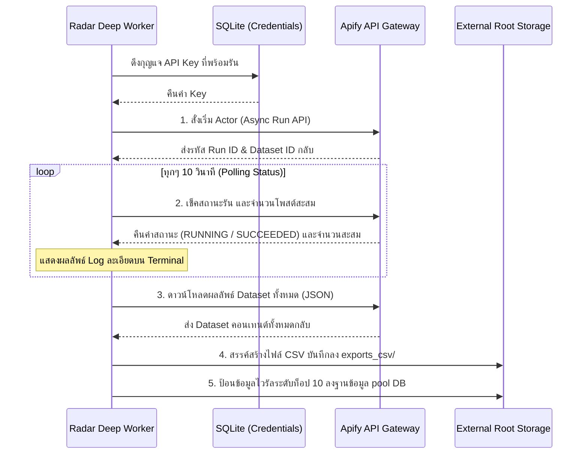

# 01. คู่มือเรดาร์สืบคู่แข่ง (Competitor Radar Specification)

เอกสารฉบับนี้คือ **ข้อกำหนดคุณลักษณะเชิงเทคนิค (Technical Specification)** สำหรับสร้างโมดูลสแกนเรดาร์เป้าหมายสืบคู่แข่ง ค้นหาโพสไวรัล คำนวณอัตราความนิยม และระบบขุดข้อมูลเชิงลึก (Deep Research) เพื่อส่งต่อวัตถุดิบคุณภาพดีเข้าคลังคอนเทนต์

---

## 1. ขอบเขตและหน้าที่การทำงาน (Objective & Scope)

โมดูลนี้ทำหน้าที่เฝ้าระวังเพจคู่แข่ง (Watchlist) ในช่องทางโซเชียลมีเดียหลัก (Facebook, TikTok) เพื่อดักสแกนหาโพสต์ที่มีความนิยมสูงสุด (Viral Posts) และดำเนินการวิเคราะห์เจาะลึกพฤติกรรมการมีส่วนร่วมของผู้ชม (Engagement Analysis)

---

## 2. การเชื่อมโยงข้อมูลและ API แหล่งดึงข้อมูล (Scraping Data Integration)

ระบบย่อยนี้จะทำงานร่วมกับ **Apify API Client** โดยดึงคีย์การดึงข้อมูลจากศูนย์กลาง และนำมาสั่งรัน API Scrapers ดังนี้:

### 2.1 Facebook Scraper (`apify~facebook-posts-scraper`)
ใช้สำหรับดึงฟีดโพสต์จากหน้า Facebook Page ที่กำหนด
*   **API Endpoint (Sync Run):**
    `POST https://api.apify.com/v2/acts/apify~facebook-posts-scraper/run-sync-get-dataset-items?token={APIFY_KEY}`
*   **JSON Input Configuration:**
    ```json
    {
      "startUrls": [{ "url": "https://www.facebook.com/PAGENAME" }],
      "resultsLimit": 30
    }
    ```
*   **โครงสร้างการ Map ข้อมูลกลับ (Output Mapping):**
    - **โพสตรงตัว:** `url` หรือ `topLevelUrl`
    - **ข้อความบรรยาย:** `text` (หากไม่มี ให้ข้ามหรือใส่ว่าง)
    - **ประเภทโพสต์:** หากมี `viewsCount` ให้ตั้งค่าเป็น `video` / `reel` หากไม่ใช่ให้ตรวจสอบ `media[0].__typename` (ถ้ามีคำว่า Photo = `photo`)
    - **ยอดการมีส่วนร่วม:** `likes` (จำนวนไลก์), `comments` (จำนวนเมนต์), `shares` (จำนวนแชร์), `viewsCount` (ยอดวิววิดีโอ)
    - **วันเวลาที่โพสต์:** `time` (ISO 8601 String)
    - **ข้อมูลอวาตาร์/ผู้ติดตามเพจ:** ดึงจาก `user.profilePic` หรือ `user.profilePicture` และดึงยอดไลก์/ผู้ติดตามจาก `user.followersCount` หรือ `pageFollowers`

### 2.2 TikTok Scraper (`clockwork~tiktok-profile-scraper`)
ใช้สำหรับดึงฟีดวิดีโอ TikTok ของแอคเคานต์เป้าหมาย
*   **API Endpoint (Sync Run):**
    `POST https://api.apify.com/v2/acts/clockwork~tiktok-profile-scraper/run-sync-get-dataset-items?token={APIFY_KEY}`
*   **JSON Input Configuration:**
    ```json
    {
      "profiles": ["username_without_at"],
      "resultsPerPage": 30
    }
    ```
*   **โครงสร้างการ Map ข้อมูลกลับ (Output Mapping):**
    - **ลิงก์วิดีโอ:** `webVideoUrl`
    - **รายละเอียด:** `text` หรือ `desc`
    - **ยอดมีส่วนร่วม:** `diggCount` (ไลก์), `commentCount` (เมนต์), `shareCount` (แชร์), `playCount` (ยอดวิว)
    - **วันเวลา:** แปลงวินาทีสะสม `createTime` (Unix Epoch) -> ISO 8601 String
    - **ข้อมูลช่อง:** อวาตาร์จาก `authorMeta.avatar` หรือ `authorMeta.avatarThumb` และผู้ติดตามจาก `authorMeta.fans`

---

## 3. สูตรคำนวณ Engagement Rate (ความคุ้มค่าและความไวรัล)

เพื่อให้ผู้ใช้เปรียบเทียบประสิทธิภาพข้ามเพจที่มีขนาดผู้ติดตามต่างกันได้อย่างยุติธรรม ระบบจะต้องคำนวณ Engagement Rate (%) ต่อหนึ่งโพสตามสูตรนี้:

$$\text{Engagement Rate (\%)} = \left( \frac{\text{ยอด Likes} + \text{ยอด Comments}}{\text{ยอดผู้ติดตาม (Followers) ณ ปัจจุบัน}} \right) \times 100$$

*(หมายเหตุ: กรณีที่ยังไม่มีข้อมูลผู้ติดตาม หรือยอดผู้ติดตามเป็น 0 ให้ส่งค่า Engagement Rate กลับเป็น `0.0`)*

---

## 4. โหมดวิจัยลึกระดับสูง (Deep Research Asynchronous Engine)

การดึงข้อมูลประวัติจำนวนมาก (300+ โพสต์) ผ่าน Sync API มักเกิดปัญหาระบบหลุดเชื่อมต่อ (Timeout) สเปกข้อกำหนดนี้จึงต้องรันในโหมด **Asynchronous Run + Polling**



### 4.1 กระบวนการทำงานเป็นขั้นตอน (Polling Process Step-by-Step)
1.  **สั่งสร้างการทำงาน (Trigger Run):** ยิง `POST https://api.apify.com/v2/acts/apify~facebook-posts-scraper/runs?token={APIFY_KEY}` พร้อมส่ง payload ระบุพิกัด URL เพจและขอบเขตจำนวน 300
2.  **เฝ้าระวังสแกน (Polling Loop):** สั่งยิงเช็คความคืบหน้าทุกๆ 10 วินาทีที่ `GET https://api.apify.com/v2/actor-runs/{RUN_ID}?token={APIFY_KEY}`
3.  **ติดตามข้อมูลชั่วคราว:** ในระหว่างลูปเช็ค ให้ยิงเรียกความคืบหน้าของ Dataset เพื่อนำจำนวนเนื้อหามาแสดงบน Log โชว์ยอดดึงสะสมจริง
4.  **สรุปข้อมูลส่งออก (Exporting):**
    - เมื่อสถานะรันแสดง `SUCCEEDED` ให้ยิงเรียกข้อมูลทั้งหมดจาก Dataset
    - นำมาแปลงเป็นไฟล์ CSV โดยใส่ BOM (`\uFEFF`) นำหน้าหัวไฟล์ เพื่อป้องกันตัวอักษรภาษาไทยแสดงผลลัพธ์เป็นภาษาต่างดาวใน Microsoft Excel
    - โครงสร้างคอลัมน์ใน CSV: `ลำดับ, ชื่อเพจ, ลิงก์โพส, ข้อความ, ประเภท, ไลก์, แชร์, คอมเมนต์, ยอดวิว, วันที่โพส`
    - เซฟไฟล์ลงใน: `exports_csv/deep_research/deep_research_{page_name}_{date}.csv`
    - ดักคัดกรอง 10 โพสต์แรกที่มีคะแนนรวมการมีส่วนร่วมสูงสุด ส่งผลลงสู่ SQLite ตาราง `vault_contents`

---

## 5. การเชื่อมต่อ API กลางและการบันทึก LOG ละเอียด (Integrations)

### 5.1 การบันทึก LOG เชิงตอบโต้กับผู้ใช้ (Interactive Logging Specification)
ระบบย่อยเรดาร์จะต้องพ่น Log การรันงานออกมาให้เข้าใจสภาวะปัจจุบัน:
- **เริ่มต้น:** `[INFO] [RadarBot] เริ่มสแกนเรดาร์สืบคู่แข่งจำนวน 5 เพจ...`
- **ขณะสแกน:** `[INFO] [RadarBot] ⏳ กำลังส่งบอทสแกนเพจ [1/5]: AI Update (FB) - ดึงลิมิต 30 โพส`
- **วิจัยลึก Polling:** `[INFO] [RadarBot] 🔄 [Deep Research Polling] รัน Scraper สำเร็จ (ID: run_9x8a) กำลังสแกนโพส ได้แล้ว 120/300 โพสต์ (ใช้เวลา 20 วินาที)`
- **สำเร็จ:** `[SUCCESS] [RadarBot] ✅ ดึงข้อมูล AI Update สำเร็จ พบโพสต์ไวรัล 3 โพสต์ ดึงเข้าคลังเรียบร้อย`

---

## 6. สคริปต์พิมพ์เขียว Mockup (Python Prototype)

ตัวอย่างพิมพ์เขียวการสแกนผ่าน Apify และทำงานร่วมกับ API หมุนกุญแจ และการเขียนผลเข้า SQLite:

```python
import sys
import os
import time
import requests
import sqlite3
from datetime import datetime

# นำเข้าระบบฐานข้อมูลและ Logger กลางจากโมดูล 00
# (สมมติว่าเขียนสัญญากลางรวมไว้ในโมดูล vault_init)
sys.path.append(os.path.dirname(os.path.dirname(os.path.abspath(__file__))))
from content_factory_v2.vault_init import VaultCredentialManager, VaultSystemInitializer

class CompetitorRadarModule:
    """ตัวควบคุมการรัน Bot เรดาร์วิเคราะห์คู่แข่ง"""
    def __init__(self, external_root_path: str):
        self.init = VaultSystemInitializer(external_root_path).setup_directories().setup_logging()
        self.logger = self.init.logger
        self.db_path = self.init.db_path
        self.cred_mgr = VaultCredentialManager(self.db_path, self.logger)

    def calculate_engagement_rate(self, likes: int, comments: int, followers: int) -> float:
        """คำนวณอัตราความคุ้มค่าของการมีส่วนร่วม"""
        if followers and followers > 0:
            return round(((likes + comments) / followers) * 100, 3)
        return 0.0

    def save_viral_post_to_vault(self, post_data: dict):
        """จัดเก็บภาพดิบ ข้อมูล และ URL ลิงก์ตรงเข้าสู่คลัง SQLite"""
        conn = sqlite3.connect(self.db_path)
        cursor = conn.cursor()
        now = datetime.now().isoformat()
        
        # ป้อนค่าฐานข้อมูล
        cursor.execute("""
            INSERT INTO vault_contents (
                id, source_type, title, raw_content, source_url, 
                author_name, author_avatar_url, author_followers,
                status, created_at, updated_at
            ) VALUES (?, 'radar', ?, ?, ?, ?, ?, ?, 'scraped', ?, ?)
            ON CONFLICT(id) DO UPDATE SET
                author_followers = excluded.author_followers,
                updated_at = ?
        """, (
            post_data['id'],
            post_data['title'],
            post_data['caption'],
            post_data['url'],
            post_data['author_name'],
            post_data['profile_pic'],
            post_data['followers'],
            now, now, now
        ))
        conn.commit()
        conn.close()
        self.logger.info(f"💾 บันทึกโพสต์ไวรัล {post_data['id'][:8]} ลง SQLite สำเร็จ")

    def run_deep_research(self, page_url: str, page_name: str, limit: int = 300):
        """รันสแกนลึก 300 โพสต์แบบ Async ป้องกันการหลุดเชื่อมต่อ (Timeout)"""
        self.logger.info(f"🔬 เริ่มรันวิจัยเชิงลึก (Deep Research) สำหรับ {page_name} - ดึง {limit} โพสต์")
        
        try:
            apify_key = self.cred_mgr.get_active_key("apify")
        except ValueError as e:
            self.logger.error(f"ไม่สามารถเริ่มงานได้: {e}")
            return

        # 1. ยิงเปิดการรัน Async
        run_url = f"https://api.apify.com/v2/acts/apify~facebook-posts-scraper/runs?token={apify_key}"
        payload = {
            "startUrls": [{"url": page_url}],
            "resultsLimit": limit
        }
        
        self.logger.info("🚀 กำลังส่งตัวสั่ง Trigger ไปที่ Apify Gateway...")
        res = requests.post(run_url, json=payload)
        if not res.ok:
            self.logger.error(f"ยิงล้มเหลว: {res.status_code} - {res.text}")
            self.cred_mgr.report_key_error("apify", apify_key, f"Async run failed status {res.status_code}")
            return
            
        run_data = res.json().get("data", {})
        run_id = run_data.get("id")
        dataset_id = run_data.get("defaultDatasetId")
        
        self.logger.info(f"✅ เริ่มงานสอยประวัติแล้ว (Run ID: {run_id[:8]}... | Dataset ID: {dataset_id[:8]}...)")

        # 2. Polling Loop
        status = "RUNNING"
        elapsed = 0
        while status in ["RUNNING", "READY"]:
            time.sleep(10)
            elapsed += 10
            
            # เช็คสถานะ
            status_res = requests.get(f"https://api.apify.com/v2/actor-runs/{run_id}?token={apify_key}")
            if not status_res.ok:
                self.logger.warning("สแกนเช็คสถานะไม่ผ่านในรอบนี้...")
                continue
                
            status_data = status_res.json().get("data", {})
            status = status_data.get("status", "UNKNOWN")
            
            # เช็คยอดสแกนจริงสะสม
            ds_res = requests.get(f"https://api.apify.com/v2/datasets/{dataset_id}?token={apify_key}")
            item_count = ds_res.json().get("data", {}).get("itemCount", 0) if ds_res.ok else 0
            
            self.logger.info(
                f"🔄 [Polling] โหมดสอยข้อมูล -> สถานะ: {status} | "
                f"กวาดได้แล้ว: {item_count} โพสต์ (ผ่านไปแล้ว {elapsed} วินาที)"
            )

        # 3. ดาวน์โหลดเมื่อ SUCCEEDED
        if status == "SUCCEEDED":
            self.logger.info("🎉 Scraper รันเสร็จเรียบร้อย! กำลังดาวน์โหลดข้อมูล Dataset...")
            items_res = requests.get(f"https://api.apify.com/v2/datasets/{dataset_id}/items?token={apify_key}&format=json")
            if items_res.ok:
                items = items_res.json()
                self.logger.info(f"ดึงข้อมูลดิบลงมาสำเร็จทั้งหมด {len(items)} แถว")
                
                # 4. สรรค์สร้างไฟล์ CSV บันทึกเก็บภายนอกแอปหลัก
                self.export_to_csv(page_name, items)
            else:
                self.logger.error("ดาวน์โหลดข้อมูล Dataset ล้มเหลว")
        else:
            self.logger.error(f"สิ้นสุดการทำงานแบบไม่สมบูรณ์ สถานะสุดท้าย: {status}")

    def export_to_csv(self, page_name: str, items: list):
        """ส่งออกประวัติสอยคู่แข่งเป็นไฟล์ CSV ภาษาไทยสมบูรณ์"""
        csv_dir = os.path.join(self.init.root_path, "exports_csv/deep_research")
        filename = f"deep_research_{page_name}_{datetime.now().strftime('%Y-%m-%d')}.csv"
        full_path = os.path.join(csv_dir, filename)
        
        csv_header = "ลำดับ,ชื่อเพจ,ลิงก์โพส,ข้อความ,ประเภท,ไลก์,แชร์,คอมเมนต์,ยอดวิว,วันที่โพส"
        rows = [csv_header]
        
        for idx, d in enumerate(items):
            post_url = d.get("url", d.get("topLevelUrl", ""))
            text = String_clean(d.get("text", "ไม่มีข้อความ"))
            likes = d.get("likes", 0)
            shares = d.get("shares", 0)
            comments = d.get("comments", 0)
            views = d.get("viewsCount", 0)
            posted_at = d.get("time", "")
            
            rows.append(f"{idx+1},{page_name},{post_url},\"{text}\",post,{likes},{shares},{comments},{views},\"{posted_at}\"")

        # บันทึกเป็นไฟล์พร้อม BOM เพื่อให้เปิดไทยบน Excel ไม่พัง
        with open(full_path, "w", encoding="utf-8-sig") as f:
            f.write("\n".join(rows))
            
        self.logger.info(f"📂 สอย CSV เชิงลึกสำเร็จและเซฟลง: {full_path}")

def String_clean(text: str) -> str:
    """ลบสัญลักษณ์ขึ้นบรรทัดใหม่และคอมมาเพื่อไม่ให้ CSV ฉีกแถว"""
    return text.replace("\n", " ").replace("\r", " ").replace(",", " ").replace('"', '""').strip()[:200]
