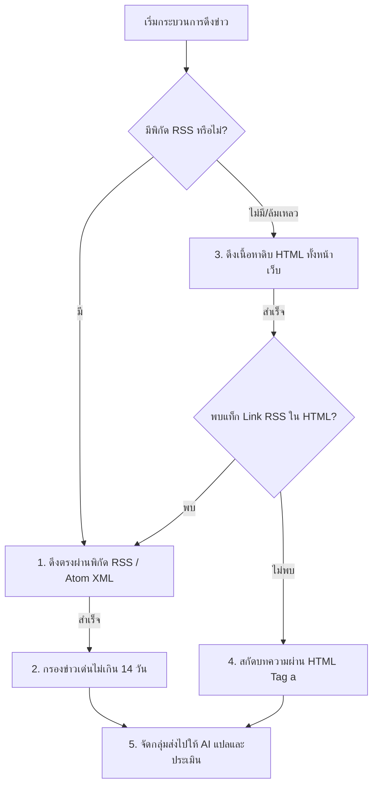

# 02. คู่มือค้นหาข่าวสาร RSS และระบบประเมินคะแนน AI (RSS Scraper Specification)

เอกสารฉบับนี้คือ **ข้อกำหนดคุณลักษณะเชิงเทคนิค (Technical Specification)** สำหรับสร้างโมดูลขุดคุ้ยกระแสข่าวสารจาก RSS Feed หรือการกวาดหน้าเว็บไซต์ข่าว และการใช้ปัญญาประดิษฐ์ประเมินคะแนนความน่าแชร์ (News Score & Evergreen Score) พร้อมส่งเข้าคลัง Content

---

## 1. ขอบเขตและหน้าที่การทำงาน (Objective & Scope)

โมดูลนี้ทำหน้าที่มอนิเตอร์กระแสข่าวสารเชิงธุรกิจ การลงทุน เทคโนโลยี และปัญญาประดิษฐ์ (AI) จากแหล่งข่าวรอบโลก แปลเป็นไทยประเด็นเด่น และประเมินความไวรัลด้วย AI เพื่อคัดสรร "เฉพาะเนื้อหาเกรด A" บันทึกเป็นเสบียงวัตถุดิบลงในฐานข้อมูล SQLite

---

## 2. โครงสร้างการเชื่อมต่อดึงข้อมูล (RSS Feed Crawling Engine)

โมดูล RSS Scraper จะรันลูปดึงข้อมูลจากแหล่งข่าวเป้าหมาย (เช่น TechCrunch, CNBC, Bloomberg หรือเว็บข่าวภาษาไทย) โดยมีตรรกะกวาดข้อมูล 3 ชั้นเพื่อความทนทานต่อการบล็อก (Resilience):



### 2.1 ตรรกะการหลบเลี่ยงการบล็อกและการดึงข้อมูลผ่าน Proxy (CORS Bypass)
ในการเขียนสคริปต์เบื้องหลังเพื่อเรียกหน้าเว็บข่าวจากหลายแหล่ง มักจะพบปัญหาบล็อก IP หรือ CORS (Cross-Origin Resource Sharing) ในตัวอย่างข้อกำหนดนี้จึงต้องใช้ Proxy เป็นตัวกลางหมุนเวียนดึงข้อมูล:
1.  **Proxy ที่ 1: AllOrigins** (`https://api.allorigins.win/get?url=...`)
2.  **Proxy ที่ 2: CORS Proxy.io** (`https://corsproxy.io/?...`)
3.  **Proxy ที่ 3: Codetabs Proxy** (`https://api.codetabs.com/v1/proxy/?quest=...`)
*(หากยิงตรงไม่ได้ผล ให้ระบบหมุนเวียนยิงผ่าน Proxy ตามลำดับ 1 -> 2 -> 3 เพื่อให้ระบบทำข่าวได้โดยไม่สะดุดขัดข้อง)*

### 2.2 การกรองขยะข้อมูลด้วยอายุของข่าว (Date Filter)
ระบบจะคัดกรองขยะข้อมูลโดยตรวจสอบช่อง `pubDate` (ใน RSS) หรือ `updated`/`published` (ใน Atom) 
*   **กฎเกณฑ์:** ข่าวสารที่จะถูกส่งไปให้ AI ประเมิน **ต้องมีอายุไม่เกิน 14 วัน (`MAX_ARTICLE_AGE_DAYS = 14`)** หากเกินระบบจะข้ามทันทีเพื่อประหยัดจำนวน Token การยิงของ AI

---

## 3. สมองวิเคราะห์พาดหัวและประเมินคะแนน AI (AI Valuation Engine)

เมื่อได้ข่าวสารมาเป็นกลุ่ม (Batch) ระบบจะส่งไปประเมินความไวรัลด้วย LLM โดยเรียกใช้งานโมเดล **Gemini 2.5 Flash** ผ่าน OpenRouter API

### 3.1 Prompt ควบคุมสำหรับการแปลและให้คะแนน (AI Master Prompt)
```text
System: หน้าที่ของคุณคือการเป็นบรรณาธิการข่าวการเงิน ไอที และเทคโนโลยีชั้นนำระดับโลก แปลพาดหัวข่าวภาษาอังกฤษเป็นภาษาไทยที่ดึงดูดใจ และประเมินคะแนนเชิงลึกแยกเป็น 2 หัวข้อ:

1. "news_score" (คะแนนข่าว 1-10): ความน่าสนใจเป็นกระแสทันที
   - 9-10 = ข่าวใหญ่พลิกวงการ กระทบคนวงกว้าง (เช่น FED ปรับดอกเบี้ย, วิกฤตแบงก์ล้ม, เปิดตัว AI พลิกโลก)
   - 7-8 = เทรนด์มาแรง ทริคหาเงินส่วนบุคคลที่ทำตามได้เลย
   - 4-6 = ข่าวผลประกอบการบริษัทเฉพาะด้าน, การควบรวมกิจการเฉพาะกลุ่ม
   - 1-3 = ข่าวประกาศ PR องค์กรทั่วไป หรือเรื่องที่เข้าใจยาก
   
2. "evergreen_score" (คะแนนความยั่งยืน 1-10): ความเป็นอมตะของเนื้อหา
   - 9-10 = คอนเทนต์ให้ความรู้/หลักการที่ไม่มีวันเก่า (เช่น วิธีเก็บเงินล้านแรก, กฎทองวิเคราะห์งบ)
   - 7-8 = เทรนด์ระยะยาว หรือสแกนเจาะลึกที่มีผลดีไปอีกหลายเดือน
   - 1-3 = ข่าวฉาบฉวยที่หมดความหมายในวันพรุ่งนี้ (เช่น ดัชนีหุ้นรายชั่วโมง)

3. "tags": ติดแท็กหมวดหมู่สั้นๆ 2-4 แท็ก ภาษาไทย เช่น ["AI", "สตาร์ทอัพ", "การเงินส่วนบุคคล", "การลงทุน"]

คำสั่ง: คุณต้องแปลและวิเคราะห์อินพุตรูปแบบ JSON Array ของข่าวสารต่อไปนี้ แล้วตอบกลับในรูปแบบ JSON วัตถุที่ตรงตามมาตรฐานเท่านั้น ห้ามเขียนข้อความเกริ่นนำใดๆ เด็ดขาด!

รูปแบบผลลัพธ์ JSON เป้าหมาย:
{
  "results": [
    {
      "id": "รหัสข่าวอินพุต",
      "thai_title": "พาดหัวข่าวแปลไทยที่กระแทกใจคนอ่านโซเชียล",
      "news_score": 8,
      "evergreen_score": 5,
      "tags": ["AI", "เทคโนโลยี"]
    }
  ]
}

ข้อมูลอินพุตบทความ:
{content}
```

---

## 4. มาตรฐานระบบ LOG และ API สับคีย์ฉุกเฉิน (Resilience Features)

### 4.1 ระบบ API สำรองโมเดล (LLM Fallback Architecture)
เมื่อยิง Gemini 2.5 Flash บน OpenRouter แล้วไม่ผ่าน (เช่น โควตาคีย์หมด หรือ Network พัง):
1.  ระบบจะต้องส่งสัญญาณเตือนไปที่ `VaultCredentialManager` เพื่อสลับไปคีย์สำรองถัดไป
2.  หากคีย์พรีเมียมทั้งหมดติดขัด ระบบจะต้องเลือกสลับไปเรียกใช้งาน **Free Models** ทันที เพื่อไม่ให้สคริปต์หยุดการทำงานกลางคัน:
    - fallback 1: `openai/gpt-oss-20b:free`
    - fallback 2: `qwen/qwen3-8b:free` หรือ `google/gemma-3-27b:free`

### 4.2 การพ่น LOG สรุปการดูดและสรุปคุณภาพ
*   `[INFO] [RSS-Scraper] 📡 กำลังดาวน์โหลด RSS ฟีดข่าวไอทีจาก TechCrunch...`
*   `[INFO] [RSS-Scraper] ✅ สกัดพบข่าวยอดนิยม 12 ข่าว (ผ่านการกรองอายุไม่เกิน 14 วัน)`
*   `[INFO] [RSS-Scraper] 🤖 ยิงส่ง AI ประเมินแบบกลุ่ม (Gemini 2.5 Flash | Key Candidate #2)`
*   `[SUCCESS] [RSS-Scraper] 💾 บันทึก 4 ข่าวเด่นที่มีคะแนนประเมิน > 7 เข้า SQLite คลัง Content เรียบร้อย (เช่น "เจาะลึก Claude Code ทำเงินหลักแสน")`

---

## 5. สคริปต์พิมพ์เขียว Mockup (Python Prototype)

ตัวอย่างพิมพ์เขียวการสแกน RSS แปลและส่งประเมิน AI พร้อมเขียนลงฐานข้อมูล:

```python
import sys
import os
import urllib.parse
import xml.etree.ElementTree as ET
import requests
import sqlite3
from datetime import datetime, timedelta

sys.path.append(os.path.dirname(os.path.dirname(os.path.abspath(__file__))))
from content_factory_v2.vault_init import VaultCredentialManager, VaultSystemInitializer

class RSSDiscoveryModule:
    """ระบบขุดและสแกนข่าวจาก RSS Feed พร้อมจัดหมวดด้วย AI"""
    def __init__(self, external_root_path: str):
        self.init = VaultSystemInitializer(external_root_path).setup_directories().setup_logging()
        self.logger = self.init.logger
        self.db_path = self.init.db_path
        self.cred_mgr = VaultCredentialManager(self.db_path, self.logger)
        self.proxies = [
            "https://api.allorigins.win/get?url=",
            "https://corsproxy.io/?",
            "https://api.codetabs.com/v1/proxy/?quest="
        ]

    def fetch_with_proxies(self, target_url: str) -> str:
        """ลองดึงผ่าน CORS Proxy ยอดนิยมทีละชั้นเพื่อเลี่ยงการโดนบล็อก"""
        for i, proxy_base in enumerate(self.proxies):
            try:
                # ปรับแต่ง URL ตามประเภท Proxy
                if "allorigins" in proxy_base:
                    url = f"{proxy_base}{urllib.parse.quote(target_url)}"
                    res = requests.get(url, timeout=12)
                    if res.ok:
                        contents = res.json().get("contents")
                        if contents:
                            return contents
                else:
                    url = f"{proxy_base}{target_url}"
                    res = requests.get(url, timeout=12)
                    if res.ok:
                        return res.text
            except Exception as e:
                self.logger.warning(f"Proxy #{i+1} ขัดข้อง ({e}) -> กำลังสลับไปตัวถัดไป")
        
        # ถ้าระบบ Proxy ทั้งหมดหลุด ให้ลองยิงตรงๆ เป็นไม้สุดท้าย
        self.logger.info("ลองเชื่อมต่อตรงเข้าสู่เซิร์ฟเวอร์...")
        res = requests.get(target_url, timeout=10)
        if res.ok:
            return res.text
        raise ConnectionError("ทุกระบบดึงข้อมูลล้มเหลว (บล็อก IP/Network ขัดข้อง)")

    def parse_rss_xml(self, xml_text: str) -> list:
        """แกะโครงสร้าง XML ของ RSS 2.0 สกัดชื่อเรื่อง ลิงก์ และวันที่"""
        articles = []
        now = datetime.now()
        max_age = timedelta(days=14)
        
        try:
            root = ET.fromstring(xml_text)
            # รองรับทั้ง RSS 2.0 และ Atom XML
            items = root.findall(".//item")
            if not items:
                items = root.findall(".//{http://www.w3.org/2005/Atom}entry")
                
            for el in items:
                title = el.find("title")
                link = el.find("link")
                pub_date = el.find("pubDate") or el.find("{http://www.w3.org/2005/Atom}published")
                
                title_text = title.text.strip() if title is not None else ""
                link_url = link.text.strip() if link is not None else ""
                if not link_url and link is not None:
                    # ใน Atom บางรุ่น Link จะอยู่เป็น attribute href
                    link_url = link.attrib.get("href", "")

                # กรองอายุของข่าว
                if pub_date is not None and pub_date.text:
                    try:
                        # ตัวอย่างการ parse แบบย่อ (ความจริงควรใช้ dateutil.parser)
                        date_str = pub_date.text.split(",")[1].split("GMT")[0].strip()
                        pub_dt = datetime.strptime(date_str, "%d %b %Y %H:%M:%S")
                        if (now - pub_dt) > max_age:
                            continue # ข้ามข่าวเก่าเกิน 14 วัน
                    except:
                        pass # ถ้าแกะวันที่ผิดพลาด ให้คงข่าวไว้ก่อนเพื่อความปลอดภัย
                
                if len(title_text) > 10 and link_url:
                    articles.append({
                        "title": title_text,
                        "url": link_url,
                        "id": str(hash(link_url))
                    })
        except Exception as e:
            self.logger.error(f"การแกะ XML เสียหาย: {e}")
        return articles

    def evaluate_news_with_ai(self, batch_articles: list) -> list:
        """ยิงประเมิน AI แบบกลุ่มเพื่อประหยัดจำนวน Tokens"""
        if not batch_articles:
            return []
            
        try:
            openrouter_key = self.cred_mgr.get_active_key("openrouter")
        except ValueError as e:
            self.logger.error(f"ระงับการทำงาน AI: {e}")
            return []

        # สรุปโครงสร้างเพื่อยิงหา AI
        compact_input = [{"id": a["id"], "title": a["title"]} for a in batch_articles]
        
        prompt = f"""วิเคราะห์บทความเหล่านี้แล้วตอบกลับในรูปแบบ JSON วัตถุที่ตรงตามมาตรฐานเท่านั้น ห้ามเขียนข้อความเกริ่นนำ:
        {json_dumps(compact_input)}"""

        # ทำการยิง API
        url = "https://openrouter.ai/api/v1/chat/completions"
        headers = {
            "Authorization": f"Bearer {openrouter_key}",
            "Content-Type": "application/json"
        }
        
        payload = {
            "model": "google/gemini-2.5-flash",
            "messages": [
                {"role": "system", "content": "คุณคือบก.ข่าว แปลชื่อข่าวภาษาไทย และให้คะแนนความน่าแชร์ (news_score: 1-10, evergreen_score: 1-10) และใส่ tags: []"},
                {"role": "user", "content": prompt}
            ]
        }

        self.logger.info("🤖 กำลังส่งพาดหัวข่าวให้ Gemini ประเมินความพรีเมียม...")
        res = requests.post(url, json=payload, headers=headers)
        
        if not res.ok:
            self.logger.warning("Gemini Key มีปัญหา กำลังเรียกโมดูลสำรองฟรี...")
            # Fallback Model logic
            payload["model"] = "openai/gpt-oss-20b:free"
            res = requests.post(url, json=payload, headers=headers)
            if not res.ok:
                self.logger.error("ระงับ AI: ทั้งหมดติดขัด")
                return []

        # แกะผลลัพธ์
        try:
            raw_text = res.json()["choices"][0]["message"]["content"]
            # Clean JSON Markdown tags
            clean_json = raw_text.replace("```json", "").replace("```", "").strip()
            parsed_results = json_loads(clean_json).get("results", [])
            
            evaluated = []
            for item in parsed_results:
                matched = next((a for a in batch_articles if str(a["id"]) == str(item["id"])), None)
                if matched:
                    matched.update({
                        "thai_title": item.get("thai_title"),
                        "news_score": item.get("news_score", 5),
                        "evergreen_score": item.get("evergreen_score", 5),
                        "tags": item.get("tags", [])
                    })
                    evaluated.append(matched)
            return evaluated
        except Exception as e:
            self.logger.error(f"ประมวลคำตอบ AI ผิดพลาด: {e}")
            return []

    def save_to_vault(self, evaluated_articles: list):
        """บันทึกข่าวเด่นระดับเกรดพรีเมียมลงสู่ SQLite Content Vault"""
        conn = sqlite3.connect(self.db_path)
        cursor = conn.cursor()
        now = datetime.now().isoformat()
        
        added_count = 0
        for art in evaluated_articles:
            # เก็บเฉพาะข่าวสารเกรดสูง (คะแนนข่าวหรือ evergreen >= 7)
            if art.get("news_score", 0) < 7 and art.get("evergreen_score", 0) < 7:
                continue
                
            cursor.execute("""
                INSERT INTO vault_contents (
                    id, source_type, title, selected_headline, raw_content, 
                    source_url, rating_news, rating_evergreen, metadata_json,
                    status, created_at, updated_at
                ) VALUES (?, 'rss', ?, ?, ?, ?, ?, ?, ?, 'ready_for_design', ?, ?)
                ON CONFLICT(id) DO NOTHING
            """, (
                art["id"],
                art["title"],
                art["thai_title"],
                art["title"],  # ใน RSS ข่าวจะใช้ตัวชื่อข่าวเดิมเป็น raw_content
                art["url"],
                art["news_score"],
                art["evergreen_score"],
                json_dumps({"tags": art["tags"]}),
                now, now
            ))
            if cursor.rowcount > 0:
                added_count += 1
                
        conn.commit()
        conn.close()
        self.logger.info(f"🎉 คัดกรองข่าวเกรด A และเซฟลงคลังได้สำเร็จ: {added_count} ข่าว!")


def json_dumps(data) -> str:
    import json
    return json.dumps(data, ensure_ascii=False)

def json_loads(text) -> dict:
    import json
    return json.loads(text)

# ==========================================
# ตัวอย่างจำลองการทดสอบดึงและสแกนข่าว RSS
# ==========================================
if __name__ == "__main__":
    module = RSSDiscoveryModule("./my_content_vault_v2")
    
    # ตัวอย่างฟีด TechCrunch
    rss_url = "https://techcrunch.com/feed/"
    try:
        xml_data = module.fetch_with_proxies(rss_url)
        raw_list = module.parse_rss_xml(xml_data)
        
        if raw_list:
            # ดึงทีละก้อนย่อย (เช่น 5 ข่าว) เพื่อทดสอบ
            evaluated = module.evaluate_news_with_ai(raw_list[:5])
            module.save_to_vault(evaluated)
    except Exception as e:
        module.logger.error(f"ขั้นตอนทดสอบสะดุด: {e}")
