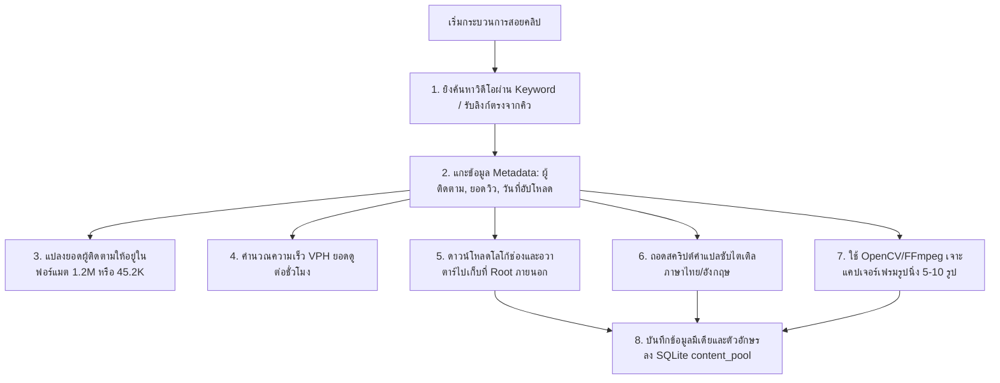

# 03. คู่มือระบบขุดคลิป YouTube ดึงซับไตเติล และแคปเจอร์เฟรม (YouTube Extractor Spec)

เอกสารฉบับนี้คือ **ข้อกำหนดคุณลักษณะเชิงเทคนิค (Technical Specification)** สำหรับสร้างโมดูลระบบค้นหาคลิป YouTube ด้วยคีย์เวิร์ด, การแกะข้อมูลเจ้าของช่องและโลโก้, การดึงคำแปลถอดเสียง (Transcript), การแคปรูปนิ่งหลายๆ รูปจากวิดีโอ (Frame Extraction) และข้อเสนอแนะฟีเจอร์ระดับสูง

---

## 1. ขอบเขตและหน้าที่การทำงาน (Objective & Scope)

โมดูลนี้ทำหน้าที่ค้นหาและสกัด "สาระสำคัญและมีเดียประกอบ" จากคลิป YouTube เพื่อใช้เป็นแหล่งข้อมูลในการเขียนโพสและเป็นวัตถุดิบสร้างสรรค์ภาพปก โดยจะต้องสกัดข้อมูลครบถ้วนทั้งตัวอักษรและรูปภาพ แล้วนำไปจัดชุดเก็บไว้ในคลัง Content ภายนอกเครื่อง

---

## 2. ขั้นตอนการกวาดและแกะข้อมูล (YouTube Data Acquisition)

ระบบขุด YouTube จะประกอบไปด้วย 2 ส่วนหลัก:
1.  **โหมดค้นหาคีย์เวิร์ด (Keyword Search Engine):** ค้นหาวิดีโอที่ตรงกับคีย์เวิร์ดเป้าหมาย และดึงผลลัพธ์มาเรียงตามลำดับความคุ้มค่า
2.  **โหมดดึงคิวสกัดสด (Extractor Engine):** หยิบคลิปจากคิวมาแยกมีเดียและข้อความอย่างละเอียด



---

## 3. รายละเอียดข้อมูลและ Asset ที่ต้องทำการดึงและจัดฟอร์แมต

### 3.1 การสกัดและจัดฟอร์แมตข้อมูลผู้ติดตาม (Subscriber Count Formatting)
เพื่อนำยอดผู้ติดตามไปวาดลงบนการ์ดผู้ติดตามของ Canvas ในภายหลังอย่างสวยงาม ระบบจะต้องจัดฟอร์แมตตัวเลขดังนี้:
*   ยอดซับ $\ge 1,000,000$: แปลงเป็นรูปแบบ `X.XM subscribers` (ทศนิยม 1 ตำแหน่ง เช่น `1,250,000` -> `1.3M subscribers`)
*   ยอดซับ $\ge 1,000$ และ $< 1,000,000$: แปลงเป็นรูปแบบ `X.XK subscribers` (เช่น `45,200` -> `45.2K subscribers`)
*   ยอดซับ $< 1,000$: แสดงเป็นตัวเลขจำนวนเต็มตามจริง (เช่น `850` -> `850 subscribers`)

### 3.2 ระบบสกัดภาพนิ่งหลายรูปจากวินาทีต่างๆ (Frame Extraction Engine)
*   ระบบจะต้องไม่สกัดเพียงแค่รูปปก (Thumbnail) เท่านั้น แต่ต้องเข้าถึงเนื้อในวิดีโอเพื่อ **ดึงสกรีนช็อตจำนวน 5 - 10 รูป** ออกมาทำเป็นภาพนิ่งฉากประทับใจ
*   **ตรรกะการคำนวณช่วงวินาที:** คำนวณจากความยาวของวิดีโอ (Duration) หารด้วยจำนวนรูปที่ต้องการ (`frameCount`) โดยกระจายวินาทีเท่าๆ กันตลอดคลิป เช่น วิดีโอยาว 10 นาที (600 วินาที) ต้องการ 5 รูป:
    - รูปที่ 1: วินาทีที่ 60 (10%)
    - รูปที่ 2: วินาทีที่ 180 (30%)
    - รูปที่ 3: วินาทีที่ 300 (50%)
    - รูปที่ 4: วินาทีที่ 420 (70%)
    - รูปที่ 5: วินาทีที่ 540 (90%)
*   **การเก็บไฟล์:** บันทึกรูปภาพเหล่านี้เป็นไฟล์ `.jpg` เก็บไว้ใน: `downloaded_media/youtube_frames/{video_id}/frame_{index}.jpg`

### 3.3 ระบบถอดซับสคริปต์คำพูด (YouTube Transcript)
*   ระบบต้องยิงไปถอดคำพูดจากซับไตเติล (Subtitles / Transcript) ทั้งที่เป็นซับจริงที่ช่องจัดทำ และซับที่สร้างโดยปัญญาประดิษฐ์อัตโนมัติ (ASR - Auto Speech Recognition) เพื่อให้ได้บทพูดเนื้อหาเต็มสำหรับป้อนให้ AI นำไปเขียนบทความโพสต่อ

---

## 4. ข้อเสนอแนะฟีเจอร์เด่นระดับสูงที่จะช่วยหนุนคลัง Content (Advanced Metrics)

เพื่อให้คลัง Content V2 ของคุณฉลาดล้ำและคัดแยกกระแสได้เหนือกว่าเดิม ผมขอเสนอแนะให้คุณดักเก็บค่าเพิ่มเติมเหล่านี้ลงคลังในหมวด `metadata_json`:

1.  **ค่า VPH (Views Per Hour - ยอดดูต่อชั่วโมง):**
    - **สูตรคำนวณ:**
      $$\text{VPH} = \frac{\text{ยอดวิวรวม}}{\text{จำนวนชั่วโมงตั้งแต่คลิปอัปโหลด}}$$
    - **ประโยชน์:** ช่วยตรวจจับว่าคลิปไหนกำลังเป็นไวรัลพุ่งแรงในขณะนี้ (Trending Velocity) ดีกว่าดูยอดวิวรวมอย่างเดียว เพราะบางคลิปวิวรวมหลักล้านแต่เป็นของเก่า 5 ปีที่แล้ว ส่วนคลิปวิวแสนที่อัปโหลดได้ 2 ชั่วโมงจะมี VPH ที่พุ่งสูงกว่ามาก
2.  **ดึง Tags คีย์เวิร์ดของวิดีโอ:** สกัดแท็กที่เจ้าของช่องติดไว้หลังบ้าน เพื่อนำมาประกอบเป็นดัชนีสืบค้นหา (Tags Auto-Indexing) ในคลัง Content ทำให้ค้นหากันเองเจอได้รวดเร็ว
3.  **ความยาวคลิป (Duration) และหมวดหมู่วิดีโอ (Category):** เพื่อวิเคราะห์ว่าคลิปสไตล์ไหนที่เหมาะนำมาทำโพสแชร์ด่วน

---

## 5. มาตรฐานระบบ LOG และ API (Integrations)

### 5.1 ระบบรายงาน LOG บน Terminal และเก็บไฟล์ดิสก์
*   `[INFO] [YT-Extractor] 🔍 เริ่มค้นหา YouTube ด้วยคีย์เวิร์ด 'AI Agent 2026' คัดสรรยอดนิยม...`
*   `[INFO] [YT-Extractor] 📺 พบวิดีโอเด่น ID: qzY7x9a8 (ชื่อ: เจาะลึกการสร้าง AI Agent ทำเงินแสน)`
*   `[INFO] [YT-Extractor] 📥 ถอดรหัสเจ้าของช่อง: ช่อง 'TechLab' (ยอดซับ: 452K | โลโก้บันทึกลง author_logos/)`
*   `[INFO] [YT-Extractor] 🗣️ ดึงซับไตเติลถอดเสียงสำเร็จ: สกัดข้อความภาษาไทยรวม 3,200 คำ`
*   `[INFO] [YT-Extractor] 🎬 รันคำสั่ง OpenCV/FFmpeg: กำลังสกัดเฟรมภาพ 5 เฟรม ตามช่วงเวลาคลิป...`
*   `[SUCCESS] [YT-Extractor] 💾 บันทึก "เจาะลึกการสร้าง AI Agent" ลงตาราง vault_contents พร้อม VPH: 1,450 vph เรียบร้อย`

---

## 6. สคริปต์พิมพ์เขียว Mockup (Python Prototype)

ตัวอย่างพิมพ์เขียวการดาวน์โหลดข้อมูล รายละเอียดช่อง สคริปต์ซับไตเติล และการแยกเฟรมด้วย `OpenCV`:

```python
import sys
import os
import sqlite3
import json
import requests
from datetime import datetime

# นำเข้าระบบฐานข้อมูลและ Logger กลางจากโมดูล 00
sys.path.append(os.path.dirname(os.path.dirname(os.path.abspath(__file__))))
from content_factory_v2.vault_init import VaultCredentialManager, VaultSystemInitializer

# ตรวจสอบแพ็คเกจเสริม (ต้องติดตั้ง opencv-python และ youtube-transcript-api)
try:
    import cv2
    from youtube_transcript_api import YouTubeTranscriptApi
except ImportError:
    print("[!] กรุณาติดตั้ง pip install opencv-python youtube-transcript-api")

class YoutubeExtractorModule:
    """ระบบสแกนวิดีโอ YouTube ดึงซับ ถอดเสียง และแคปเจอร์สกรีนเฟรม"""
    def __init__(self, external_root_path: str):
        self.init = VaultSystemInitializer(external_root_path).setup_directories().setup_logging()
        self.logger = self.init.logger
        self.db_path = self.init.db_path
        self.cred_mgr = VaultCredentialManager(self.db_path, self.logger)

    def format_subscribers(self, count: int) -> str:
        """แปลงตัวเลขผู้ติดตามให้อยู่ในรูปแบบสากลจำง่าย"""
        if not count:
            return ""
        if count >= 1_000_000:
            return f"{round(count / 1_000_000, 1)}M subscribers"
        elif count >= 1_000:
            return f"{round(count / 1_000, 1)}K subscribers"
        return f"{count} subscribers"

    def calculate_vph(self, total_views: int, published_time_str: str) -> float:
        """คำนวณอัตราความเร็ว VPH (Views Per Hour)"""
        try:
            pub_time = datetime.fromisoformat(published_time_str.replace("Z", "+00:00"))
            hours_diff = (datetime.now(pub_time.tzinfo) - pub_time).total_seconds() / 3600.0
            hours_diff = max(0.5, hours_diff) # ป้องกันหารด้วยศูนย์กรณีคลิปเพิ่งลง
            return round(total_views / hours_diff, 1)
        except Exception as e:
            self.logger.warning(f"คำนวณ VPH ผิดพลาด: {e}")
            return 0.0

    def download_channel_logo(self, channel_name: str, logo_url: str) -> str:
        """ดาวน์โหลดและบันทึกโลโก้ช่องลงในโฟลเดอร์ภายนอก"""
        if not logo_url:
            return ""
        try:
            filename = f"logo_{channel_name.replace(' ', '_')}.jpg"
            save_path = os.path.join(self.init.root_path, "downloaded_media/author_logos", filename)
            
            res = requests.get(logo_url, timeout=10)
            if res.ok:
                with open(save_path, "wb") as f:
                    f.write(res.content)
                self.logger.info(f"ดาวน์โหลดโลโก้ช่องสำเร็จ: {save_path}")
                return save_path
        except Exception as e:
            self.logger.warning(f"โหลดโลโก้ช่องล้มเหลว: {e}")
        return ""

    def extract_video_frames(self, video_id: str, video_url_or_filepath: str, frame_count: int = 5) -> list:
        """เจาะเข้าดึงเฟรมรูปภาพตามเวลาที่กำหนดโดยใช้ OpenCV"""
        saved_paths = []
        frames_dir = os.path.join(self.init.root_path, f"downloaded_media/youtube_frames/{video_id}")
        os.makedirs(frames_dir, exist_ok=True)

        self.logger.info(f"🎬 เริ่มสกัดเฟรมภาพนิ่งจำนวน {frame_count} รูป...")
        
        # สำหรับสเปกที่ดึงผ่านลิงก์ตรง หากเป็นการดึงสตรีมสดจริงควรดาวน์โหลดแบบย่อด้วย yt-dlp ก่อน
        # ตัวอย่างพิมพ์เขียวนี้แสดงการเข้าแกะข้อมูลผ่านไฟล์วิดีโอหรือสตรีม
        cap = cv2.VideoCapture(video_url_or_filepath)
        if not cap.isOpened():
            self.logger.warning(f"OpenCV เปิดดึงวิดีโอตรงไม่ได้: {video_url_or_filepath}")
            return []

        total_frames = int(cap.get(cv2.CAP_PROP_FRAME_COUNT))
        if total_frames <= 0:
            return []

        interval = total_frames // (frame_count + 1)
        for i in range(1, frame_count + 1):
            frame_idx = i * interval
            cap.set(cv2.CAP_PROP_POS_FRAMES, frame_idx)
            ret, frame = cap.read()
            if ret:
                filename = f"frame_{i}.jpg"
                full_path = os.path.join(frames_dir, filename)
                cv2.imwrite(full_path, frame)
                saved_paths.append(full_path)
                self.logger.info(f" - สกัดเฟรมสำเร็จ [{i}/{frame_count}]: {full_path}")
                
        cap.release()
        return saved_paths

    def fetch_transcript(self, video_id: str) -> str:
        """ดาวน์โหลดสคริปต์ถอดความพูดของคลิปวิดีโอ"""
        self.logger.info(f"🗣️ เริ่มดึงสคริปต์คำพูดสำหรับวิดีโอ: {video_id}")
        try:
            # ดึงคำบรรยาย (รองรับ TH ก่อน แล้วเปลี่ยนเป็น EN เผื่อไม่มี)
            transcript_list = YouTubeTranscriptApi.get_transcript(video_id, languages=['th', 'en'])
            text_lines = [item['text'] for item in transcript_list]
            return " ".join(text_lines)
        except Exception as e:
            self.logger.warning(f"ไม่พบซับไตเติลภาษาไทย/อังกฤษ: {e}")
            return ""

    def save_youtube_to_vault(self, video_data: dict, transcript: str, frame_paths: list):
        """บันทึกข้อมูลและมีเดียทั้งหมดเข้าฐานข้อมูล pool SQLite"""
        conn = sqlite3.connect(self.db_path)
        cursor = conn.cursor()
        now = datetime.now().isoformat()
        
        metadata = {
            "views": video_data.get("views", 0),
            "vph": video_data.get("vph", 0.0),
            "tags": video_data.get("tags", []),
            "duration": video_data.get("duration", "")
        }

        cursor.execute("""
            INSERT INTO vault_contents (
                id, source_type, title, selected_headline, raw_content, 
                source_url, author_name, author_avatar_url, author_followers,
                metadata_json, media_paths_json, status, created_at, updated_at
            ) VALUES (?, 'youtube', ?, ?, ?, ?, ?, ?, ?, ?, ?, 'ready_for_design', ?, ?)
            ON CONFLICT(id) DO UPDATE SET
                author_followers = excluded.author_followers,
                metadata_json = excluded.metadata_json,
                updated_at = ?
        """, (
            video_data["id"],
            video_data["title"],
            video_data["title"], # เริ่มแรกให้ใช้ชื่อวิดีโอเป็นพาดหัวเลือก
            transcript if transcript else video_data["title"],
            video_data["url"],
            video_data["channel_name"],
            video_data["channel_logo_local"],
            video_data["subscriber_count"],
            json.dumps(metadata, ensure_ascii=False),
            json.dumps(frame_paths),
            now, now, now
        ))
        
        conn.commit()
        conn.close()
        self.logger.info(f"🎉 เก็บข้อมูลวิดีโอ {video_data['id']} ลง SQLite Content Vault สำเร็จสมบูรณ์")

# ==========================================
# ตัวอย่างการเรียกงานโมดูลย่อย YouTube Extractor
# ==========================================
if __name__ == "__main__":
    extractor = YoutubeExtractorModule("./my_content_vault_v2")
    
    # ข้อมูลวิดีโอสมมติ
    video_id = "qzY7x9a8"
    fake_video = {
        "id": video_id,
        "title": "สอนสร้าง AI Agent ตั้งแต่เริ่มต้นทำเงินแสน",
        "url": f"https://www.youtube.com/watch?v={video_id}",
        "channel_name": "TechLab",
        "channel_logo_url": "https://yt3.ggpht.com/avatar_test.jpg",
        "subscriber_count": 452000,
        "views": 25000,
        "tags": ["AI Agent", "SaaS", "สอนเขียนโปรแกรม"],
        "duration": "15:20"
    }
    
    # 1. คำนวณสถิติ VPH
    fake_video["vph"] = extractor.calculate_vph(fake_video["views"], "2026-05-25T12:00:00Z")
    
    # 2. ฟอร์แมตซับ
    fake_video["subscriber_count_formatted"] = extractor.format_subscribers(fake_video["subscriber_count"])
    
    # 3. โหลดโลโก้ช่อง
    fake_video["channel_logo_local"] = extractor.download_channel_logo(
        fake_video["channel_name"], fake_video["channel_logo_url"]
    )
    
    # 4. ถอดบทพูด
    transcript_text = extractor.fetch_transcript(video_id)
    
    # 5. สกัดรูป (ข้าม OpenCV จริงหากยังไม่ได้รันไฟล์วิดีโอดิบ)
    frames = []
    # frames = extractor.extract_video_frames(video_id, "stream_link_here.mp4")
    
    # 6. เก็บเข้าคลัง
    extractor.save_youtube_to_vault(fake_video, transcript_text, frames)
