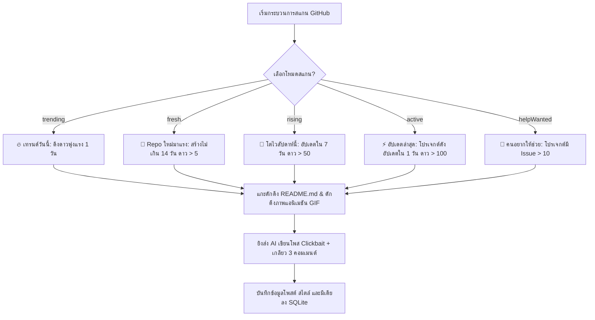

# 04. คู่มือเจาะกระแส GitHub และระบบป้อนไอเดีย Clickbait AI (GitHub Spec)

เอกสารฉบับนี้คือ **ข้อกำหนดคุณลักษณะเชิงเทคนิค (Technical Specification)** สำหรับสร้างโมดูลขุดคุ้ยโปรเจกต์โอเพ่นซอร์สมาแรงบน GitHub, การดักดูดภาพเคลื่อนไหว (GIFs), และปัญญาประดิษฐ์สร้างสรรค์แคปชั่นสาย Clickbait พร้อม 3 คอมเมนต์ต่อเกลียว (Thread)

---

## 1. ขอบเขตและหน้าที่การทำงาน (Objective & Scope)

โมดูลนี้ทำหน้าที่มอนิเตอร์ GitHub Repositories เพื่อสกัดหาคลังโปรเจกต์ด้าน AI, SaaS และ Developer Tools ที่กำลังได้รับความนิยม นำเนื้อหา README มาสกัดสรุปย่อ และเขียนออกมาเป็นแคปชั่นไทยที่มีความดึงดูดใจสูงสุด (Clickbait) พร้อมปักหมุดลิงก์จริงและมีเดียแอนิเมชันลงในคลังคอนเทนต์

---

## 2. โหมดการดึงแนวโน้ม GitHub (GitHub Discovery Engines)

ระบบย่อยนี้สามารถเลือกดึงโปรเจกต์ได้ 5 โหมดสแกน เพื่อป้อนวัตถุดิบคอนเทนต์หลากหลายแนว:



### 2.1 รายละเอียดเงื่อนไขการค้นหาของแต่ละโหมด (GitHub Query Specs)
*   **🔥 เทรนด์วันนี้ (`trending`):** ดึงจาก API Trending รายวัน หรือดึง Repo ที่ขยับมีดาวขึ้นเร็วใน 1 วัน เรียงตาม `stars`
*   **🌱 Repo ใหม่มาแรง (`fresh`):** ค้นผ่านคิวรี: `{keyword} created:>=[14 วันก่อน] stars:>5 is:public`
*   **🚀 โตไวสัปดาห์นี้ (`rising`):** ค้นผ่านคิวรี: `{keyword} pushed:>=[7 วันก่อน] stars:>50 is:public`
*   **⚡ อัปเดตล่าสุด (`active`):** ค้นผ่านคิวรี: `{keyword} pushed:>=[1 วันก่อน] stars:>100 is:public` เรียงตาม `updated`
*   **🙋 คนอยากให้ช่วย (`helpWanted`):** ค้นผ่านคิวรี: `{keyword} help-wanted-issues:>10 is:public` เรียงตาม `help-wanted-issues`

---

## 3. ระบบดักดูดรูปแอนิเมชันภาพเคลื่อนไหว (GIF Extraction Logic)

*   **ปัญหาหลัก:** โพสเกี่ยวกับการเขียนโค้ดและไอทีจะได้รับความนิยมสูงหากมีรูปแอนิเมชันการรันจริง (Demo GIFs) ซึ่งส่วนใหญ่ผู้พัฒนาจะฝังไว้ในหน้า README.md
*   **ตรรกะสกัดภาพ (Regex Scraper):** สแกนหาพิกัด URL รูปภาพในมาร์กดาวน์ README ที่ลงท้ายด้วย `.gif` โดยใช้สองรูปแบบ:
    1.  **Markdown Tag:** `!\[.*?\]\((https?:\/\/.*?\.(?:gif))\)`
    2.  **HTML Image Tag:** `]+src=["'](https?:\/\/.*?\.(?:gif))["']`
*   **การกรองขยะ:** คัดทิ้งรูปที่เป็นตราสัญลักษณ์สะสมคะแนน (Badge) เช่น `shields.io`, `badge.svg`, `travis-ci` หรือรูปภาพโลโก้ขนาดเล็ก
*   **การจัดเก็บ:** ดึงรูป GIF คุณภาพสูง 3 ลำดับแรก บันทึกพิกัด URL หรือดาวน์โหลดมาเก็บไว้ที่ Directory `downloaded_media/competitor_assets/`

---

## 4. ปัญญาประดิษฐ์สร้างโพสและเกลียว 3 คอมเมนต์ (Thread Writer Engine)

ส่งข้อมูลรายละเอียด Repo และข้อมูลสรุป README ไปที่ **Gemini 2.5 Flash** ผ่าน OpenRouter เพื่อเรียบเรียงโพสกระตุ้นกระแส

### 4.1 Prompt สำหรับสร้าง Clickbait Thread
```text
System: คุณคือผู้เชี่ยวชาญระดับสูงในการเขียนโพสต์ Facebook สายเทคโนโลยี AI และการสร้างรายได้
หน้าที่ของคุณคือ เขียนโพสต์กระทู้ (Thread) ภาษาไทย ที่น่าติดตามอย่างยิ่ง โดยตอบกลับเป็นรูปแบบ JSON โครงสร้างตามสั่ง ห้ามพิมพ์ตัวหนังสือจีนใดๆ เด็ดขาด!

รูปแบบผลลัพธ์ JSON เป้าหมาย:
{
  "clickbait_caption": [
    "แบบพาดหัวทางเลือกที่ 1 (ดึงดูด/ FOMO / มีตัวเลขล่อใจ) ... (มีต่อ👇)",
    "แบบพาดหัวทางเลือกที่ 2 ... (มีต่อ👇)",
    "แบบพาดหัวทางเลือกที่ 3 ... (มีต่อ👇)"
  ],
  "comment_1": "ความยาวปานกลาง: เกริ่นนำเปิดใจ อธิบายว่าเครื่องมือนี้คืออะไร และทำไมคนไอที/SaaS ต้องรู้ พร้อมข้อดีข้อ 1-2 ในรูปเช็คลิสต์",
  "comment_2": "ความยาวปานกลาง: เล่าฟีเจอร์เด่นและประโยชน์จริงข้อ 3-5 แบบเจาะใจ",
  "comment_3": "สรุปปิดท้ายท้าทายความคิดเห็น พร้อมบอกพิกัดลิงก์ต้นทาง 👉 ลิงก์ GitHub: {repo_url}"
}
```

---

## 5. ข้อเสนอแนะการจัดเก็บและต่อยอดในคลัง Content (Vault Recommendations)

เพื่อให้โมดูล GitHub ของคุณทำงานร่วมกับฐานข้อมูล SQLite กลางได้อย่างเต็มประสิทธิภาพ ผมขอเสนอแนวทางดังนี้:

1.  **การแยกหมวดหมู่เชิงดัชนี (Category Mapping):**
    ในขั้นตอนจัดบันทึก ให้คัดแยกแท็กคีย์เวิร์ดของ Repo เก็บลงช่อง `metadata_json` ภายใต้คีย์ `"tech_stack": ["AI-Agent", "SaaS", "Automation"]` เพื่อแยกกลุ่มระหว่างคอนเทนต์ทั่วไปกับคอนเทนต์ไอทีลึกซ้ำ
2.  **แนวทางต่อยอด GIF-to-MP4 Auto-Conversion (ภาพโพสแบบวิดีโอสั้น):**
    เนื่องจากอัลกอริทึมของ Facebook และ TikTok ปัจจุบันชอบวิดีโอมากกว่าภาพนิ่งเดี่ยว ในคลัง Content V2 ควรออกแบบระบบให้รองรับการสั่งให้ **FFmpeg** ดำเนินการแปลงภาพเคลื่อนไหว GIF ที่ดูดมาได้ ให้กลายเป็นไฟล์วิดีโอสั้นวนลูป 5 วินาที (.mp4) โดยอัตโนมัติ เพื่อส่งไปโพสต์ลงหน้า Reels หรือโพสคู่กับเนื้อหา Clickbait ได้ทันที

---

## 6. สคริปต์พิมพ์เขียว Mockup (Python Prototype)

ตัวอย่างพิมพ์เขียวการดึง Repo, สกัดรูป GIF แอนิเมชัน และการยิง AI เพื่อป้อนข้อมูลลงคลัง SQLite:

```python
import sys
import os
import re
import sqlite3
import json
import requests
from datetime import datetime

sys.path.append(os.path.dirname(os.path.dirname(os.path.abspath(__file__))))
from content_factory_v2.vault_init import VaultCredentialManager, VaultSystemInitializer

class GithubDiscoveryModule:
    """ตัวควบคุมการค้นหา Repo ดาวรุ่งและใช้ AI แปลงเป็นบทความแชร์ต่อ"""
    def __init__(self, external_root_path: str):
        self.init = VaultSystemInitializer(external_root_path).setup_directories().setup_logging()
        self.logger = self.init.logger
        self.db_path = self.init.db_path
        self.cred_mgr = VaultCredentialManager(self.db_path, self.logger)

    def search_trending_repos(self, topic: str, limit: int = 10) -> list:
        """ยิงดึงยอดนิยมจาก GitHub Search API"""
        self.logger.info(f"🔥 ค้นหา GitHub Repo มาแรงในหมวด: {topic}")
        url = f"https://api.github.com/search/repositories?q={topic}+stars:>50&sort=stars&order=desc"
        headers = {"Accept": "application/vnd.github.v3+json"}
        
        # แนบ GitHub token ถ้ามีเพื่อลดลิมิตเรทโดนบล็อก
        try:
            token = self.cred_mgr.get_active_key("github")
            headers["Authorization"] = f"token {token}"
        except:
            pass

        res = requests.get(url, headers=headers, timeout=12)
        if res.ok:
            items = res.json().get("items", [])
            self.logger.info(f"พบ Repo ที่ตรงเงื่อนไขการวิจัย {len(items)} ตัว (เลือกประมวลผล {limit})")
            return items[:limit]
        else:
            self.logger.error("GitHub API ขัดข้อง ดึงข้อมูลแนวโน้มไม่ได้")
            return []

    def extract_gifs_from_readme(self, readme_markdown: str) -> list:
        """สกัดรูป Demo GIFs ที่ผู้พัฒนาโพสแสดงตัวอย่างออกไปใช้"""
        if not readme_markdown:
            return []
            
        # สแกนพิกัดลิ้งก์ GIF ทั้งรูป Markdown และ HTML Tag
        pattern_md = r'!\[.*?\]\((https?://[^\s)]+?\.gif)\)'
        pattern_html = r']+src=["\'](https?://[^"\']+?\.gif)["\']'
        
        gifs = re.findall(pattern_md, readme_markdown, re.IGNORECASE)
        gifs.extend(re.findall(pattern_html, readme_markdown, re.IGNORECASE))
        
        # คัดกรองเศษขยะ Badge
        clean_gifs = []
        for g in gifs:
            if not any(x in g for x in ["badge", "shields.io", "travis", "circleci"]):
                clean_gifs.append(g)
                
        # ส่งยอดเด่นกลับ 3 รูปแรก
        return list(set(clean_gifs))[:3]

    def fetch_readme_text(self, full_name: str) -> str:
        """ดาวน์โหลดเอกสาร README.md ของ Repo"""
        url = f"https://raw.githubusercontent.com/{full_name}/master/README.md"
        res = requests.get(url, timeout=10)
        if not res.ok:
            # ลองกิ่ง main เผื่อกรณีโปรเจกต์ใหม่รันบน main
            url = f"https://raw.githubusercontent.com/{full_name}/main/README.md"
            res = requests.get(url, timeout=10)
        return res.text if res.ok else ""

    def generate_clickbait_post(self, repo_info: dict, readme_text: str) -> dict:
        """ส่ง AI ร่างข้อความ clickbait 3 แคปชั่นทางเลือก พร้อม 3 คอมเมนต์ต่อเกลียว"""
        try:
            openrouter_key = self.cred_mgr.get_active_key("openrouter")
        except ValueError as e:
            self.logger.error(f"ไม่พบ Key AI: {e}")
            return {}

        prompt_data = {
            "name": repo_info["full_name"],
            "desc": repo_info["description"],
            "stars": repo_info["stargazers_count"],
            "readme_brief": readme_text[:2000] # ส่งย่อๆ เพื่อประหยัดเงินค่า Tokens
        }
        
        url = "https://openrouter.ai/api/v1/chat/completions"
        headers = {
            "Authorization": f"Bearer {openrouter_key}",
            "Content-Type": "application/json"
        }
        
        payload = {
            "model": "google/gemini-2.5-flash",
            "messages": [
                {"role": "system", "content": "คุณคือบก.สายเทคโนโลยีเขียนข้อความแนว Clickbait Facebook thread ตอบกลับในรูปแบบ JSON target format"},
                {"role": "user", "content": f"สร้างโพส Clickbait และคอมเมนต์สเปกสำหรับบทความนี้:\n{json.dumps(prompt_data)}"}
            ]
        }
        
        res = requests.post(url, json=payload, headers=headers)
        if res.ok:
            try:
                raw_text = res.json()["choices"][0]["message"]["content"]
                clean_json = raw_text.replace("```json", "").replace("```", "").strip()
                return json.loads(clean_json)
            except Exception as e:
                self.logger.error(f"แปลงคำตอบ AI ล้มเหลว: {e} - คำตอบดิบ: {raw_text[:100]}")
        return {}

    def save_github_to_vault(self, repo_info: dict, ai_post: dict, gif_urls: list):
        """บันทึกข้อมูลผลงานลงสู่ SQLite content pool"""
        if not ai_post:
            return
            
        conn = sqlite3.connect(self.db_path)
        cursor = conn.cursor()
        now = datetime.now().isoformat()
        
        # เลือกเอาหัวข้อ clickbait แบบแรกเป็น Selected Headline ตัวเบิกโรง
        captions = ai_post.get("clickbait_caption", [repo_info["full_name"]])
        selected_headline = captions[0] if captions else repo_info["full_name"]
        
        metadata = {
            "stars": repo_info["stargazers_count"],
            "language": repo_info["language"],
            "all_captions": captions,
            "comment_1": ai_post.get("comment_1", ""),
            "comment_2": ai_post.get("comment_2", ""),
            "comment_3": ai_post.get("comment_3", ""),
            "gifs": gif_urls
        }

        cursor.execute("""
            INSERT INTO vault_contents (
                id, source_type, title, selected_headline, raw_content, 
                source_url, rating_news, rating_evergreen, metadata_json,
                status, created_at, updated_at
            ) VALUES (?, 'github', ?, ?, ?, ?, 8, 8, ?, 'ready_for_design', ?, ?)
            ON CONFLICT(id) DO NOTHING
        """, (
            str(repo_info["id"]),
            repo_info["full_name"],
            selected_headline,
            repo_info["description"] if repo_info["description"] else repo_info["full_name"],
            repo_info["html_url"],
            json.dumps(metadata, ensure_ascii=False),
            now, now
        ))
        conn.commit()
        conn.close()
        self.logger.info(f"✅ บันทึกกระแส GitHub {repo_info['full_name']} ลง SQLite สำเร็จ")

# ==========================================
# จำลองการทดสอบโมดูลย่อย GitHub Discovery
# ==========================================
if __name__ == "__main__":
    module = GithubDiscoveryModule("./my_content_vault_v2")
    
    # 1. ค้นหา
    repos = module.search_trending_repos("ai-agent", limit=1)
    if repos:
        target = repos[0]
        # 2. แกะ README
        readme = module.fetch_readme_text(target["full_name"])
        # 3. เจาะสอย GIF
        gifs = module.extract_gifs_from_readme(readme)
        # 4. แปลง AI
        ai_result = module.generate_clickbait_post(target, readme)
        # 5. เก็บเข้าคลัง
        module.save_github_to_vault(target, ai_result, gifs)
