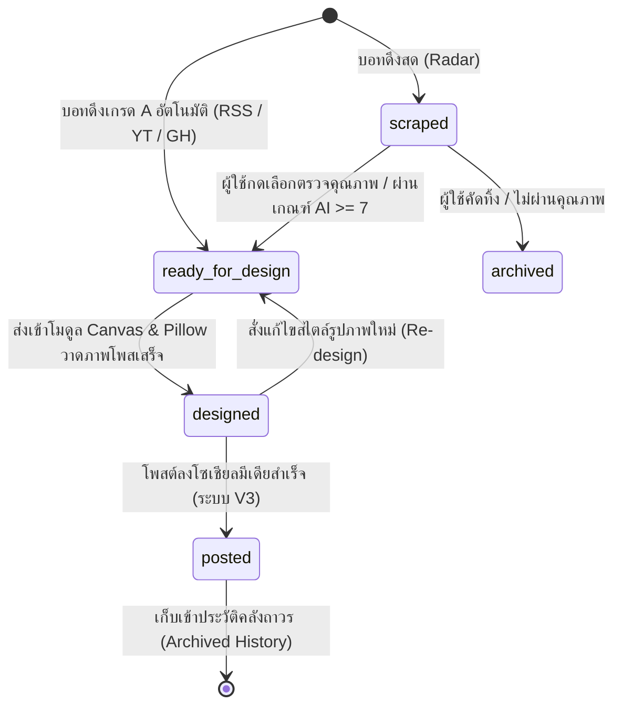

# 05. คู่มือระบบคลังเก็บเนื้อหาและการสืบค้นข้อมูลในตัว (Content Vault Specification)

เอกสารฉบับนี้คือ **ข้อกำหนดคุณลักษณะเชิงเทคนิค (Technical Specification)** สำหรับสร้างระบบคลังประมวลผล Asset, วงจรชีวิตของคอนเทนต์ (Content Lifecycle State Machine) และสเปก API สำหรับการสืบค้นหาข้อมูลร่วมกันระหว่างโมดูลค้นหาและระบบภาพโพส

---

## 1. ขอบเขตและหน้าที่การทำงาน (Objective & Scope)

โมดูลคลังเก็บเนื้อหา (Content Vault) ทำหน้าที่เป็น "ใจกลางหน่วยความจำ" (Central Storage Hub) ของระบบ V2 มีหน้าที่จัดระเบียบสารสนเทศที่ดักจับมาจากหมวดค้นหา ทำการดัชนีชิ้นมีเดีย (Media Indexer) และเปิดบริการ API ให้โมดูลภายนอกยิงเรียกข้อมูลไปประมวลผลต่อได้อย่างลื่นไหลและมีสิทธิระดับความปลอดภัยสูงสุด

---

## 2. วงจรชีวิตของชิ้นงาน (Content Lifecycle State Machine)

เพื่อให้โปรแกรมย่อยทุกหมวด (ค้นหา -> คลัง -> สร้างรูป -> ระบบโพสในอนาคต) ทำงานแยกชิ้นกันอย่างเสถียรที่สุด ข้อมูลคอนเทนต์จะต้องคุยกันผ่าน **"สเตตัสความคืบหน้า" (State Status)** ในตาราง `vault_contents` เสมอ:



### 2.1 รายละเอียดเงื่อนไขสถานะ (Status Definitions)
1.  **`scraped` (ดูดดิบ):** ข้อมูลที่สอยมาจาก Bot หรือ Competitor Radar ที่รอให้มนุษย์เข้ามาตรวจสอบ ปรับปรุง หรืออนุมัติเกรดพรีเมียม
2.  **`ready_for_design` (พร้อมสร้างรูป):** ข้อมูลข่าว ข้อมูล YouTube หรือ GitHub ที่ผ่านการคัดสรรแล้ว (มีหัวแปลไทย มีคำพูดถอดซับ) พร้อมส่งต่อให้ Pillow ทำการเขียนรูปภาพโปสเตอร์
3.  **`designed` (วาดภาพแล้ว):** รูปภาพโปสเตอร์สไตล์ Top Gainers/AI News วาดเสร็จแล้ว พิกัดรูปและข้อมูลแคปชั่น Clickbait พร้อมสำหรับการนำส่ง
4.  **`posted` (โพสต์เรียบร้อย):** ชิ้นงานได้รับการเผยแพร่ลงหน้าเพจเป้าหมายแล้ว ระบบจะล็อกแถวข้อมูลนี้ไว้เพื่อป้องกันการทำซ้ำ (No Double Post)

---

## 3. ระบบแสดงภาพและบริการไฟล์สื่อข้ามโปรแกรม (Vault Media Server API)

เนื่องจากคลังมีเดียถูกกำหนดให้อยู่นอกโฟลเดอร์แอปหลัก (External SSD/HDD) การเรียกแสดงภาพบนหน้าจอ React หรือส่งภาพข้ามระบบจะต้องผ่าน **"บริการ API สตรีมมีเดีย" (Asset Streaming Endpoint)** เพื่อป้องกันปัญหาเรื่องความปลอดภัยของ Web Browser (CORS/Path Restrictions) และป้องกันการเจาะระบบดึงไฟล์อื่นในเครื่อง (Path Traversal Protection)

### 3.1 สเปกความปลอดภัย Asset Streaming API
- **Endpoint:** `GET /api/vault/media?path={relative_media_path}`
- **ตรรกะความปลอดภัย (Security Rules):**
  1. สคริปต์หลังบ้านจะต้องถอดค่า relative path ที่รับเข้ามา
  2. ดำเนินการผสาน (Resolve) เข้ากับโฟลเดอร์ Root ภายนอกที่เซฟไว้ในตัวแปรระบบหลักเท่านั้น
  3. ตรวจสอบว่าพิกัดไฟล์ปลายทางยังอยู่ภายใต้ขอบเขตโฟลเดอร์หลัก **ห้ามมีตัวอักษรเจาะระบบถอยหลังอย่าง `../` หรือ `..\\` โผล่มาเด็ดขาด** (ถ้าตรวจพบ ให้ตอบกลับด้วย `403 Forbidden` ทันที)
  4. ทำการส่งไฟล์ภาพปลายทางกลับไปพร้อมชนิดข้อมูล Header `Content-Type: image/jpeg` หรือ `image/png`

---

## 4. สมองคลังสืบค้นด้วยตัวเองอัจฉริยะ (Self-Searching API Engine)

เพื่อให้ทุกโมดูล (โดยเฉพาะหน้าต่างจัดการในอนาคต) สามารถสืบค้นข้อมูลในคลังกันเองได้ง่ายและรวดเร็ว ระบบ Content Vault จะต้องมีระบบค้นหาความสัมพันธ์ในตัวเอง (Self-contained Search Engine)

### 4.1 พารามิเตอร์การค้นหา (Query Filtering Parameters)
เมื่อยิงเรียก `GET /api/vault/contents` ระบบจะตรวจเช็คฟิลเตอร์ตามเงื่อนไขนี้:
*   **`source_type`:** กรองหมวดที่อยากทำรูป (`radar`, `rss`, `youtube`, `github`)
*   **`status`:** ค้นหาตามสเตตัสความคืบหน้า (เช่น ค้นหา `ready_for_design` เพื่อส่งให้โปรแกรมวาดภาพ)
*   **`keyword`:** ค้นหาคำสำคัญในช่อง `title`, `selected_headline` หรือ `raw_content`
*   **`min_rating`:** กรองเฉพาะโพสที่มีคะแนน `rating_news` หรือ `rating_evergreen` สูงกว่าค่าที่กำหนด
*   **`sort_by`:** เรียงข้อมูลตาม `created_at` (ล่าสุดก่อน), เรียงตามคะแนน หรือเรียงตามยอดมีส่วนร่วม (Engagement)

---

## 5. สคริปต์พิมพ์เขียว API กลาง (Node.js Express & TypeScript Prototype)

ตัวอย่างพิมพ์เขียวการเขียนระบบ API บริการคลังคอนเทนต์ด้วย Express.js เพื่อให้เชื่อมโยงข้ามแอปพลิเคชันหลักได้อย่างลื่นไหลและมีความเสถียรสูง:

```typescript
import express, { Request, Response } from 'express';
import sqlite3 from 'sqlite3';
import path from 'path';
import fs from 'fs';

const app = express();
app.use(express.json());

// โหลดพิกัดภายนอกเครื่องจาก Env หรือ Local Configuration
const VAULT_EXTERNAL_ROOT = process.env.VAULT_ROOT || '/Volumes/ExternalSSD/ContentVault_V2';
const DB_PATH = path.join(VAULT_EXTERNAL_ROOT, 'databases/content_pool.db');

// เชื่อมต่อฐานข้อมูล SQLite กลาง
const db = new sqlite3.Database(DB_PATH, (err) => {
  if (err) console.error('❌ ไม่สามารถเปิดฐานข้อมูลคลัง Content:', err);
  else console.log('📂 เชื่อมต่อระบบคลังฐานข้อมูลสำเร็จสเปก V2');
});

/** ==========================================================
 *  1. API สืบค้นหาข้อมูลในตัว (Self-contained Content Search)
 *  ========================================================== */
app.get('/api/vault/contents', (req: Request, res: Response) => {
  const { source_type, status, keyword, min_rating, sort_by } = req.query;
  
  let sql = 'SELECT * FROM vault_contents WHERE 1=1';
  const params: any[] = [];

  if (source_type) {
    sql += ' AND source_type = ?';
    params.push(source_type);
  }
  if (status) {
    sql += ' AND status = ?';
    params.push(status);
  }
  if (keyword) {
    sql += ' AND (title LIKE ? OR selected_headline LIKE ? OR raw_content LIKE ?)';
    const searchStr = `%${keyword}%`;
    params.push(searchStr, searchStr, searchStr);
  }
  if (min_rating) {
    sql += ' AND (rating_news >= ? OR rating_evergreen >= ?)';
    params.push(Number(min_rating), Number(min_rating));
  }

  // ระบบจัดลำดับ
  if (sort_by === 'newest') {
    sql += ' ORDER BY created_at DESC';
  } else if (sort_by === 'score') {
    sql += ' ORDER BY MAX(rating_news, rating_evergreen) DESC';
  } else {
    sql += ' ORDER BY created_at DESC'; // default
  }

  db.all(sql, params, (err, rows) => {
    if (err) {
      console.error('[ERROR] สืบค้นข้อมูลล้มเหลว:', err);
      return res.status(500).json({ success: false, error: err.message });
    }
    
    // แปลงผลลัพธ์ JSON ใน Metadata กลับเป็นออบเจกต์สำหรับ React Front-end
    const formatted = rows.map((row: any) => ({
      ...row,
      metadata: row.metadata_json ? JSON.parse(row.metadata_json) : {},
      media_paths: row.media_paths_json ? JSON.parse(row.media_paths_json) : []
    }));
    
    res.json({ success: true, count: formatted.length, data: formatted });
  });
});

/** ==========================================================
 *  2. API อัปเดตสเตตัสคอนเทนต์ (State Machine Engine)
 *  ========================================================== */
app.post('/api/vault/contents/:id/status', (req: Request, res: Response) => {
  const { id } = req.params;
  const { status, selected_headline } = req.body;
  const now = new Date().toISOString();

  if (!status) {
    return res.status(400).json({ success: false, error: 'กรุณาระบุสเตตัสความคืบหน้า' });
  }

  let sql = 'UPDATE vault_contents SET status = ?, updated_at = ?';
  const params: any[] = [status, now];

  if (selected_headline) {
    sql += ', selected_headline = ?';
    params.push(selected_headline);
  }

  sql += ' WHERE id = ?';
  params.push(id);

  db.run(sql, params, function(err) {
    if (err) {
      return res.status(500).json({ success: false, error: err.message });
    }
    if (this.changes === 0) {
      return res.status(404).json({ success: false, error: 'ไม่พบ ID ชิ้นคอนเทนต์ที่กำหนด' });
    }
    console.log(`[SUCCESS] อัปเดตสเตตัสชิ้นงาน ${id} -> ${status}`);
    res.json({ success: true, message: `อัปเดตสถานะชิ้นคอนเทนต์เรียบร้อยแล้ว` });
  });
});

/** ==========================================================
 *  3. API สตรีมมีเดียภายนอกเครื่องแบบปลอดภัย (Safe Media Server)
 *  ========================================================== */
app.get('/api/vault/media', (req: Request, res: Response) => {
  const fileRelativePath = req.query.path as string;
  
  if (!fileRelativePath) {
    return res.status(400).json({ error: 'กรุณาระบุ Path ของรูปภาพ' });
  }

  // 1. ผสาน Path ป้องกันระบบเจาะดูดไฟล์ย้อนหลัง (Anti-Path Traversal Check)
  const safePath = path.normalize(fileRelativePath).replace(/^(\.\.(\/|\\))+/, '');
  const absoluteFilePath = path.join(VAULT_EXTERNAL_ROOT, safePath);

  // 2. ตรวจสอบความปลอดภัยขอบเขตโฟลเดอร์ Root
  if (!absoluteFilePath.startsWith(VAULT_EXTERNAL_ROOT)) {
    return res.status(403).json({ error: '403 Forbidden: ห้ามเข้าถึงนอกพื้นที่เก็บความมั่นคง' });
  }

  // 3. เช็คว่าไฟล์ภาพมีอยู่จริงแล้วส่งไฟล์ภาพกลับ
  fs.access(absoluteFilePath, fs.constants.F_OK, (err) => {
    if (err) {
      return res.status(404).json({ error: 'ไม่พบไฟล์ภาพประกอบที่ต้องการ' });
    }
    res.sendFile(absoluteFilePath);
  });
});

// รันพอร์ต API คลัง
const PORT = 5005;
app.listen(PORT, () => {
  console.log(`🔊 คลัง Content Vault V2 สแตนด์บายพร้อมบริการที่พอร์ต http://localhost:${PORT}`);
});
export default app;
