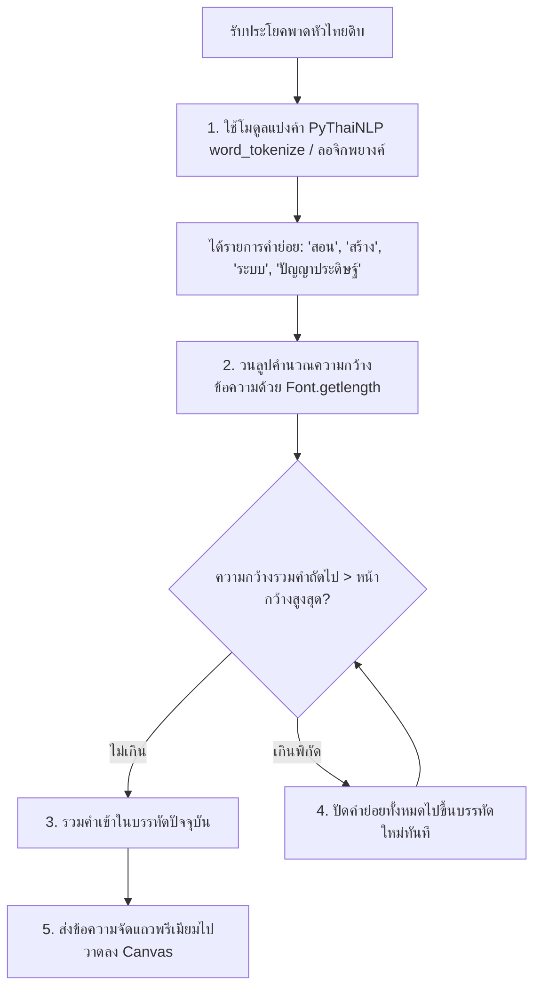

# 06. คู่มือสร้างภาพโพสอัตโนมัติและการตัดคำไทยระดับมืออาชีพ (Graphic Generator Spec)

เอกสารฉบับนี้คือ **ข้อกำหนดคุณลักษณะเชิงเทคนิค (Technical Specification)** สำหรับสร้างระบบวาดภาพประกอบโพสอัตโนมัติ (Square, Portrait, Landscape) ผ่านสคริปต์ Python Pillow และตรรกะการคำนวณเพื่อตัดคำภาษาไทยไม่ให้พยางค์ฉีกขาด (Thai Text-Wrapping Engine)

---

## 1. ขอบเขตและหน้าที่การทำงาน (Objective & Scope)

โมดูลสร้างภาพโพส (Graphic Generator) ทำหน้าที่นำบทสรุปพาดหัวภาษาไทยและรูปภาพดิบประกอบในคลัง Content Vault มาสร้างสรรค์เป็นภาพโปสเตอร์ประกอบบทความโซเชียลมีเดียระดับพรีเมียม (เช่น ปกช่องข่าว AI, เทมเพลต Top Gainers, การ์ดคำคม หรือรีวิว GitHub) โดยออกแบบโครงสร้างให้ทำงานร่วมกับ Pillow ในฝั่งระบบหลังบ้านอย่างรวดเร็ว

---

## 2. ข้อมูลเชิงมิติและประเภทเทมเพลต (Canvas Dimensions & Aspect Ratios)

ระบบจะวาดภาพออกมา 3 สัดส่วนหลัก ขึ้นอยู่กับแพลตฟอร์มปลายทาง:
*   **Square (`1:1`):** ขนาด `1080 x 1080` พิกเซล (สำหรับโพสต์ Facebook/Instagram มาตรฐาน)
*   **Landscape (`16:9`):** ขนาด `1280 x 720` พิกเซล (สำหรับหน้าปกลิงก์ หรือ YouTube)
*   **Portrait (`9:16`):** ขนาด `1080 x 1920` พิกเซล (สำหรับส่งขึ้น Reels, TikTok หรือ Story)

### 2.1 รายละเอียดการสกรีนและธีมสีระดับพรีเมียม (Curated Color Palettes)
การวาดจะคุมโทนโดยใช้ชุดสีเด่นสะดุดตา เพื่อล่อสายตาผู้อ่าน (Eye-Catching Palettes):
1.  **Classic Red Blue:** พื้นหลังดำเข้ม, อักษรขาว, กล่องไฮไลต์คำสำคัญสีแดงเฉดพรีเมียม (`#DC2626`) สลับน้ำเงินสด
2.  **Emerald Gold:** อักษรขาวเหลืองทองอร่าม (`#F59E0B`), ไฮไลต์เขียวมรกตหรูหรา (`#059669`)
3.  **Neon Purple:** สไตล์ล้ำอนาคต อักษรขาวเหลืองนีออน, กล่องไฮไลต์ม่วงนีออนสด (`#A855F7`) สลับกรอบส้ม

---

## 3. กฎทองตรรกะการตัดคำและจัดวรรคภาษาไทย (Thai Syllable Protection Engine)

**[จุดวิกฤตสูงสุด]** ปัญหาหลักของการวาดภาษาไทยบน Pillow หรือระบบกราฟิกทั่วไป คือภาษาไทยเขียนติดต่อกันไม่มีช่องว่าง ทำให้ประโยคมักจะฉีกขาดแบบไร้หลักไวยากรณ์เมื่อสิ้นสุดหน้ากว้าง เช่น คำว่า **"ประเทศ"** ถูกฉีกเป็น **"ประ"** (บรรทัดแรก) และ **"เทศ"** (บรรทัดที่สอง) ซึ่งดูไม่เป็นมืออาชีพ

เพื่อแก้ปัญหานี้ ระบบย่อย V2 จะต้องใช้ตรรกะ **การตัดแบ่งคำตามพยางค์ (Syllable-Based Tokenization)** ก่อนทำการวาด:



### 3.1 ตรรกะการปัดเศษสระและวรรณยุกต์ลอย (Thai Character Validation Rules)
ในการวาดตัวอักษรบน Canvas หรือ Pillow ตัวอักษรที่เป็น **สระบน-ล่าง และวรรณยุกต์** (เช่น  ิ,  ี,  ึ,  ื,  ุ,  ู,  ่,  ้,  ๊,  ๋,  ์) **จะต้องไม่มีการตัดเพื่อขึ้นบรรทัดใหม่เป็นตัวเดี่ยวๆ** 
*   **กฎการคำนวณ:** ในลูปตัดแบ่งบรรทัด หากอักขระตัวแรกของบรรทัดใหม่เป็นสระบน/ล่าง หรือวรรณยุกต์ลอย สคริปต์จะต้องปัดตัวอักษรพยัญชนะนำหน้าตัวนั้น (ซึ่งอยู่ท้ายบรรทัดก่อนหน้า) ให้ย้ายมาอยู่ต้นบรรทัดใหม่ร่วมกันทันที

---

## 4. โครงสร้างรายละเอียด 5 เทมเพลตหลัก (Design Component Layouts)

### 4.1 เทมเพลต "รูปสไตล์ YouTube" (YouTube documentary style)
*   **ภาพพื้นหลัง:** รูปคนแสดงอารมณ์/รูปดิบคลังครึ่งบน ผสมไล่เฉดสีดำลึก (Gradient Fade) ด้านล่าง
*   **องค์ประกอบการ์ดช่อง (Channel Badge Card):** วาดกรอบสี่เหลี่ยมโค้งมนสีดำโปร่งใส (`rgba(12,12,12,0.85)`) บริเวณมุมล่างขวา ภายในมีรูปโลโก้ช่อง YouTube ทรงกลม ชื่อช่องสีขาว และยอดซับจัดรูปแบบสวยงาม (เช่น `452K subscribers`)

### 4.2 เทมเพลต "ข่าวAI" (AI News style)
*   **ป้ายพาดขอบบนซ้าย (Top-Left News Strap):** ป้ายสี่เหลี่ยมแนบชิดขอบบนซ้ายสุด ตัวหนังสือสีขาวตรงตัวคำว่า **"ข่าวAI"** พื้นหลังสีแดงสดพาดผ่านขอบ พร้อมใส่กรอบนีออนล้อมบางๆ

### 4.3 เทมเพลต "แนะนำ GitHub" (GitHub Trends style)
*   **ป้ายพาดขอบบนซ้าย (Strap Label):** ข้อความ **"GITHUB"** แถบสีเขียว หรือสไตล์หรู ดึงดูดสายตาสำหรับแนะนำโปรเจกต์นักพัฒนา

### 4.4 เทมเพลต "คำคม / บทเรียน" (Inspiring Quotes style)
*   **การจัดรูปแบบ:** จัดข้อความตรงกลาง (Center Alignment) ใช้เครื่องหมายอัญประกาศคู่ตัวใหญ่สุดคลาสสิก (`“` และ `”`) ลอยเหนือข้อความ สไตล์มินิมอลขาวทองทองแดง

### 4.5 เทมเพลต "หน้าข่าว Top Gainers" (Editorial Banner style)
*   **โครงสร้างแบ่งเขตภาพ (Dynamic Grid Split):** 
  - ส่วน 60% บนสุดเป็นรูปดิบพร้อมการไล่เฉดดำเงา
  - มีแถบคาดเส้นสีแสดหรือทองคาดขวาง (Divider Line) ความกว้าง 8 พิกเซล
  - ส่วน 40% ล่างสุดเป็น **กล่องสีดำทึบสนิทสำหรับปูพื้นหลังพาดหัวข่าว**
*   **การวาดอักษรมีไฮไลต์ (Highlighted Words Block):** ส่ง AI หรือสแกนหาคำสำคัญในข่าว (เช่นคำคีย์เวิร์ด หรือตัวเลขเปอร์เซ็นต์) วาดกล่องสี่เหลี่ยมหมุนเอียงเล็กน้อย (`-0.015 rad`) สีแดงหรือสีเหลืองเป็นพื้นหลังคำนั้นๆ ส่วนคำอื่นเป็นอักษรสีขาวลอยเด่น

---

## 5. การเชื่อมต่อและระบบ LOG ละเอียด (Integrations)

### 5.1 ระบบ LOG รายงานตำแหน่งวาดและคีย์เวิร์ด
*   `[INFO] [PillowDraw] 🎨 เริ่มต้นประมวลผลงานภาพโพสต์ ID: content_009 สัดส่วน 1:1...`
*   `[INFO] [PillowDraw] 🗣️ พาดหัวเป้าหมาย: 'สร้างวิดีโอ AI ในไม่กี่นาทีด้วย Claude AI ผสม Remotion'`
*   `[INFO] [PillowDraw] ✂️ รันตรรกะตัดคำ Syllable Protection ได้ผลลัพธ์การขึ้นบรรทัดใหม่ 3 แถวเป๊ะ (ไม่มีพยางค์ฉีก)`
*   `[INFO] [PillowDraw] 🖍️ พบคีย์เวิร์ดเด่นสำหรับทำกล่องไฮไลต์: ['Claude AI', 'Remotion']`
*   `[INFO] [PillowDraw] 🎯 วาดกล่องไฮไลต์สีทองรอบคำว่า 'Claude AI' หมุนเอียง 1.2 องศา`
*   `[SUCCESS] [PillowDraw] 💾 บันทึกรูปวาดเสร็จสมบูรณ์ลง: generated_graphics/pillow_renders/render_009.png พร้อมเขียนพิกัดเข้า SQLite`

---

## 6. สคริปต์พิมพ์เขียว Mockup (Python Pillow Prototype)

ตัวอย่างพิมพ์เขียวการตัดข้อความไทยและวาดภาพสไตล์ Top Gainers ด้วย Python `Pillow`:

```python
import sys
import os
import sqlite3
import json
from datetime import datetime
from PIL import Image, ImageDraw, ImageFont, ImageFilter

sys.path.append(os.path.dirname(os.path.dirname(os.path.abspath(__file__))))
from content_factory_v2.vault_init import VaultSystemInitializer

# ตรวจสอบการใช้งาน PyThaiNLP เพื่อตัดพยางค์ไทยให้แม่นยำ
try:
    from pythainlp import word_tokenize
except ImportError:
    # fallback tokenization ถ้าผู้ใช้ไม่มี pythainlp
    def word_tokenize(text, engine="newcut"):
        return text.split(" ")

class ThaiSyllableWrapper:
    """ระบบจัดคำและห่อประโยคภาษาไทยระดับพรีเมียมไม่ให้ฉีกคำ"""
    def __init__(self, font, max_width):
        self.font = font
        self.max_width = max_width

    def get_text_width(self, text: str) -> int:
        """คำนวณหาหน้ากว้างจริงของฟอนต์ตัวหนังสือ"""
        return int(self.font.getlength(text))

    def wrap_text(self, text: str) -> list:
        """ตัดแบ่งประโยคไทยตามคำย่อย ป้องกันพยางค์ฉีกพัง"""
        words = word_tokenize(text, engine="newcut")
        lines = []
        current_line = ""
        
        for word in words:
            test_line = f"{current_line}{word}" if current_line else word
            # เช็คว่าหน้ากว้างเกินขอบเขตหรือไม่
            if self.get_text_width(test_line) > self.max_width:
                if current_line:
                    lines.append(current_line)
                current_line = word
            else:
                current_line = test_line
                
        if current_line:
            lines.append(current_line)
            
        return lines

class GraphicGeneratorModule:
    """ระบบวาดภาพ Pillow ระดับสูง รองรับ Template คาดขอบข่าวและไล่โทนสี"""
    def __init__(self, external_root_path: str):
        self.init = VaultSystemInitializer(external_root_path).setup_directories().setup_logging()
        self.logger = self.init.logger
        self.db_path = self.init.db_path

    def draw_top_gainers_poster(self, content_id: str, base_image_path: str, headline: str, keywords: list):
        """สร้างปกโพสสไตล์ Top Gainers คาดยางดำด้านล่างพร้อมไฮไลต์ตัวหนังสือ"""
        self.logger.info(f"เริ่มผลิตภาพปกสไตล์ Top Gainers สำหรับ ID: {content_id}")
        
        try:
            # 1. โหลดภาพพื้นหลังดิบ
            base_img = Image.open(base_image_path).convert("RGBA")
        except Exception as e:
            self.logger.error(f"โหลดภาพประกอบดิบไม่สำเร็จ: {e}")
            return

        # ปรับสเกลภาพให้เป็น 1:1 (Square: 1080x1080)
        target_w, target_h = 1080, 1080
        canvas = Image.new("RGBA", (target_w, target_h), "black")
        
        # ปรับรูปขนาดพอดีภาพ
        img_aspect = base_img.width / base_img.height
        if img_aspect > 1:
            new_h = target_h
            new_w = int(target_h * img_aspect)
        else:
            new_w = target_w
            new_h = int(target_w / img_aspect)
        
        resized_base = base_img.resize((new_w, new_h), Image.Resampling.LANCZOS)
        # แปะรูปตรงกลาง
        offset_x = (target_w - new_w) // 2
        offset_y = (target_h - new_h) // 2
        canvas.paste(resized_base, (offset_x, offset_y))

        # 2. วาดกล่องคาดขอบด้านล่าง (Bottom Headline Box - Split 40%)
        draw = ImageDraw.Draw(canvas)
        image_split_y = int(target_h * 0.60)
        
        # วาดเส้นแบ่งขอบสีทอง (Gold Divider Bar) ความสูง 8px
        draw.rectangle([(0, image_split_y - 8), (target_w, image_split_y)], fill="#F59E0B")
        
        # วาดกล่องดำทึบครึ่งล่าง
        draw.rectangle([(0, image_split_y), (target_w, target_h)], fill="#0C0C0C")

        # 3. เตรียมฟอนต์ไทย Kanit (ต้องแนบไฟล์ .ttf ไว้ในโปรแกรม)
        font_path = "Mitr-Medium.ttf"  # สามารถสลับเป็น Kanit-Black.ttf หรือ Prompt ได้
        if not os.path.exists(font_path):
            font = ImageFont.load_default()
            self.logger.warning("ไม่พบฟอนต์ไทยในระบบ จะรันวาดด้วย Font สำรองแทน")
        else:
            font = ImageFont.truetype(font_path, 60) # ขนาดอักษรพาดหัวเด่น 60px

        # 4. ตัดคำแบ่งบรรทัด
        max_text_width = target_w - 100 # เว้นขอบข้างละ 50px
        wrapper = ThaiSyllableWrapper(font, max_text_width)
        lines = wrapper.wrap_text(headline)

        # 5. วาดอักษรและไฮไลต์กล่องสีเหลืองรอบคำสำคัญ
        y_cursor = image_split_y + 40
        line_height = 80
        
        for line in lines:
            # ค้นหาและวาดกล่องรอบคำไฮไลต์
            x_cursor = 50
            words = word_tokenize(line, engine="newcut")
            
            for word in words:
                word_w = int(font.getlength(word))
                
                # ถ้าคำนี้อยู่ในลิสต์คีย์เวิร์ดเด่น ให้วาดพื้นหลังสีแสดทองล้อมกรอบ
                if word in keywords or any(k in word for k in keywords):
                    # วาดกล่องไฮไลต์ (ขยายขนาด 6px ทุกทิศทางเพื่อความพรีเมียม)
                    draw.rounded_rectangle(
                        [(x_cursor - 6, y_cursor - 4), (x_cursor + word_w + 6, y_cursor + 68)],
                        radius=8, fill="#F59E0B"
                    )
                    # วาดตัวหนังสือสีดำลงบนกล่องเหลือง
                    draw.text((x_cursor, y_cursor), word, font=font, fill="black")
                else:
                    # วาดตัวหนังสือสีขาวธรรมดา
                    draw.text((x_cursor, y_cursor), word, font=font, fill="white")
                    
                x_cursor += word_w
                
            y_cursor += line_height

        # 6. เซฟรูปลงโฟลเดอร์ภายนอกเครื่อง
        save_filename = f"render_{content_id}_{datetime.now().strftime('%H%M%S')}.png"
        save_path = os.path.join(self.init.root_path, "generated_graphics/pillow_renders", save_filename)
        
        # แปลงเป็น RGB ก่อนเซฟเป็น PNG / JPG
        final_render = canvas.convert("RGB")
        final_render.save(save_path, "PNG")
        self.logger.info(f"🎉 วาดรูปประกอบ Clickbait สำเร็จและจัดเซฟที่: {save_path}")

        # 7. เขียนประวัติและลิ้งก์ลง SQLite
        self.write_render_history_to_db(content_id, save_path)

    def write_render_history_to_db(self, content_id: str, file_path: str):
        """บันทึกภาพวาดเสร็จสมบูรณ์ลงฐานข้อมูลSQLite พร้อมขยับสเตตัสคอนเทนต์"""
        conn = sqlite3.connect(self.db_path)
        cursor = conn.cursor()
        now = datetime.now().isoformat()
        render_id = f"img_{datetime.now().strftime('%y%m%d%H%M%S')}"

        # 1. เขียนลงตาราง generated_graphics
        cursor.execute("""
            INSERT INTO generated_graphics (id, content_id, file_path, image_ratio, theme_name, created_at)
            VALUES (?, ?, ?, '1:1', 'Top Gainers', ?)
        """, (render_id, content_id, file_path, now))

        # 2. ปรับปรุงสถานะ vault_contents เป็น 'designed'
        cursor.execute("""
            UPDATE vault_contents SET status = 'designed', updated_at = ? WHERE id = ?
        """, (now, content_id))

        conn.commit()
        conn.close()
        self.logger.info(f"💾 อัปเดต SQLite: ขยับสถานะ คอนเทนต์ {content_id} -> 'designed'")

# ==========================================
# จำลองการทดสอบสร้างรูปปก Top Gainers
# ==========================================
if __name__ == "__main__":
    generator = GraphicGeneratorModule("./my_content_vault_v2")
    
    # ข้อมูลทดลอง
    fake_content_id = "1098234"
    fake_base_image = "test_source.jpg"
    fake_headline = "สร้างรายได้หลักแสนด้วย Claude AI ยุค 2026"
    fake_keywords = ["Claude AI", "หลักแสน"]

    # สร้างรูปดิบจำลองขนาด 800x800 สำหรับทดสอบ
    if not os.path.exists(fake_base_image):
        img = Image.new("RGB", (800, 800), color="#1e1e2f")
        img.save(fake_base_image)
        
    generator.draw_top_gainers_poster(
        fake_content_id, fake_base_image, fake_headline, fake_keywords
    )
    
    # ลบรูปทดลองหลังรันเสร็จ
    if os.path.exists(fake_base_image):
        os.remove(fake_base_image)
