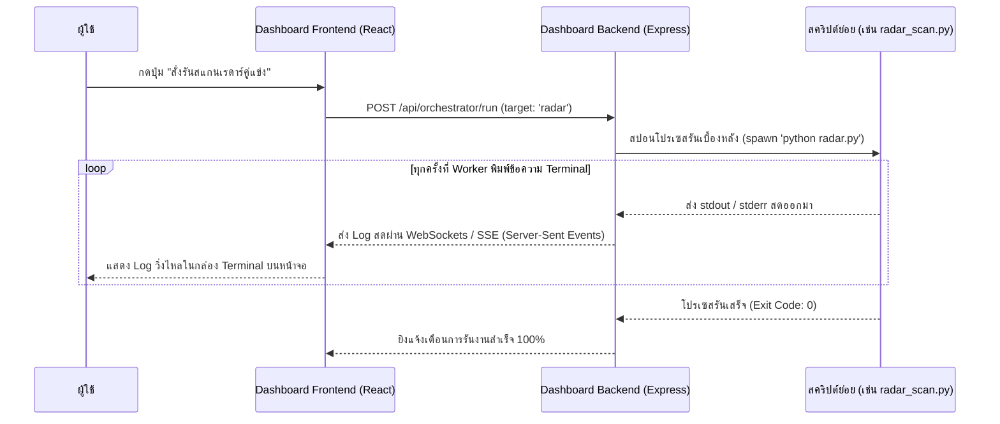

# 07. คู่มือแดชบอร์ดกลางควบคุมระบบแยกชิ้น (Central Dashboard Orchestrator Spec)

เอกสารฉบับนี้คือ **ข้อกำหนดคุณลักษณะเชิงเทคนิค (Technical Specification)** สำหรับสร้างหน้า Dashboard ควบคุมส่วนกลาง (Central Dashboard Shell) ทำหน้าที่ประสานงาน เรียกใช้งานแอปพลิเคชันย่อยในหมวดค้นหา คลัง Content และโมดูลสร้างภาพโพส ให้รวมแสดงผลลัพธ์เป็นหน้าจอเดียวกันอย่างลื่นไหล ไร้ปัญหาระบบแครชลามปาม

---

## 1. ขอบเขตและหน้าที่การทำงาน (Objective & Scope)

ปัญหาเดิมของระบบ Monolithic ก้อนใหญ่คือ เมื่อส่วนใดส่วนหนึ่งพังหรือมีปัญหาเรื่อง Port ทับซ้อน ระบบทั้งหมดจะเปิดไม่ติด (Monolithic Crash)

**ทางออกของ V2:**
เราจะทำโปรแกรมย่อยทุกตัวแยกไฟล์รันกันอย่างเด็ดขาด จากนั้นเราจะสร้าง **"Dashboard กลาง" (Orchestrator Shell)** ขึ้นมาครอบ ซึ่งทำหน้าที่เป็นหน้ากาก UI คอยเรียกสั่งการทำงานของโปรแกรมย่อยเหล่านั้นทีละชิ้นผ่านคำสั่งระบบหลังบ้าน (Background Child Processes) ทำให้ผู้ใช้รู้สึกว่ากำลังใช้โปรแกรมเดียวกันอยู่ แต่โค้ดและกระบวนการทำงานข้างหลังถูกแยกออกจากกันอย่างสมบูรณ์แบบ (Decoupled execution)

```text
       [ หน้ากาก Dashboard กลาง (React Front-end: Port 5173) ]
                                 │
                                 ▼
         [ ระบบสั่งการหลังบ้าน (Node.js/Python API: Port 5005) ]
                                 │
         ┌───────────────────────┼───────────────────────┐
         ▼                       ▼                       ▼
   [สคริปต์ค้นหาย่อย]       [ SQLite คลังกลาง ]      [สคริปต์สร้างรูป Pillow]
  (รันแบบ Child Process)   (content_pool.db)       (รันเมื่อสั่งวาดโปสเตอร์)
```

---

## 2. ทำไมสถาปัตยกรรมแบบนี้ถึงลดโอกาสการเกิด Error จนเป็นศูนย์?

1.  **การแยกขอบเขตความเสียหาย (Fault Isolation):**
    หากสคริปต์ดึงคู่แข่ง (Radar) เกิดแครช หรือ Apify คีย์หมด ตัวสคริปต์จะปิดการทำงานตัวเองลงเงียบๆ โดย **ตัวหน้าจอ Dashboard และตัวคลังคอนเทนต์จะไม่มีวันแครชตามไปด้วย** ผู้ใช้ยังสามารถเข้าไปคัดลอกรูปภาพหรือสแกนดึง GitHub ได้ตามปกติ
2.  **การล็อกพอร์ตถาวร (Locked Ports Policy):**
    แอปจะใช้เพียงพอร์ตเดียวในการคุยกันคือ ตัว Backend API (เช่น พอร์ต `5005`) และตัวหน้าบ้าน React (พอร์ต `5173`) ไม่มีการสุ่มพอร์ต หรือพอร์ตเปลี่ยนไปเปลี่ยนมาจนเกิดข้อผิดพลาด
3.  **การทำงานขนานอย่างอิสระ (Asynchronous Execution):**
    เมื่อสั่งดึงข้อมูล สคริปต์หลังบ้านจะสั่งรัน Bot แยกโปรเซสออกไปทำงานในพื้นหลัง (Background thread) ทำให้ผู้ใช้สามารถกดสลับหน้าต่างทำงานส่วนอื่นๆ ได้โดยไม่ต้องนอนรอหน้าจอโหลดให้เสร็จสิ้น

---

## 3. สถาปัตยกรรมหน้ากาก UI แดชบอร์ดกลาง (Frontend Structure)

หน้ากาก Dashboard จะแบ่งการนำทางออกเป็น **3 แท็บควบคุมหลัก** เพื่อรวมบริการทุกอย่างมาให้ครบถ้วน:

### 3.1 แท็บที่ 1: หมวดค้นหา (Discovery Portal)
*   **อินเตอร์เฟซ:** แผงควบคุมแบ่งย่อยเป็น 4 เมนู (เรดาร์คู่แข่ง, ข่าว RSS, YouTube Extractor, GitHub Trends)
*   **การควบคุม:** 
    - มีปุ่ม **"สั่งรันบอทสแกนสด"** เพื่อส่งคำสั่งไปที่หลังบ้านให้สตาร์ทรันสคริปต์ดูดข้อมูล
    - มีกล่องแสดง LOG แบบ Real-time Terminal เพื่อแสดงข้อความส่งกลับจากบอทสแกนให้ผู้ใช้เห็นสถานการณ์สดในขณะนั้น

### 3.2 แท็บที่ 2: คลัง Content (Vault Manager)
*   **อินเตอร์เฟซ:** ตารางแสดงผลรายการวัตถุดิบทั้งหมดที่ดูดมาได้จาก SQLite
*   **การควบคุม:** 
    - ค้นหาด้วยคำสำคัญ กรองตามคะแนนคุณภาพ AI หรือกรองตามแหล่งดึงข้อมูล
    - มีปุ่มตรวจเช็คข้อมูล และกดปุ่ม **"อนุมัติเพื่อวาดรูป" (Approve for Design)** เพื่อเปลี่ยนสถานะเป็น `ready_for_design`

### 3.3 แท็บที่ 3: สร้าง Content (Graphic Canvas)
*   **อินเตอร์เฟซ:** แผงแสดงรายการบทความที่ผ่านการอนุมัติแล้ว พร้อมดึงภาพเฟรม YouTube หรือภาพสต็อกมาแสดงให้เลือก
*   **การควบคุม:**
    - ให้ผู้ใช้เลือกธีมสี สเกลรูปภาพ แปะภาพ และพิมพ์เกลาพาดหัวข่าว
    - เมื่อผู้ใช้กด **"สั่งสร้างภาพโปสเตอร์"** Dashboard จะส่งพิกัดไฟล์และพาดหัวข่าวไปให้ระบบ Pillow วาดรูป และนำภาพปกที่วาดเสร็จแล้วมาแสดงพรีวิวบนหน้าจอทันที

---

## 4. ระบบรันโปรแกรมเบื้องหลังและเชื่อมโยง Log สด (Process Executor)

การเชื่อมหน้าจอ Dashboard เข้ากับสคริปต์ย่อย จะใช้ตรรกะ **"สปอนโปรเซส" (Process Spawning)** ผ่าน Node.js `child_process` หรือคำสั่งของภาษาที่คุณใช้ โดยทำการดึงข้อความจาก Terminal ของโปรแกรมย่อยมาส่งให้หน้าจอ Dashboard ทันที



---

## 5. สคริปต์พิมพ์เขียวตัวสั่งการหลังบ้าน (Node.js Express Child-Process Engine)

นี่คือพิมพ์เขียวจำลองระบบสั่งการรันสคริปต์เบื้องหลังแยกชิ้น และการส่ง Log สดผ่าน **Server-Sent Events (SSE)** เพื่อให้หน้าจอ React ดึง Log ไปแสดงผลได้อย่างนุ่มนวลและไม่เกิดข้อผิดพลาด:

```typescript
import express, { Request, Response } from 'express';
import { spawn } from 'child_process';
import path from 'path';

const app = express();
app.use(express.json());

// พิกัดเก็บไฟล์คู่มือและสคริปต์ย่อยทั้งหมด
const SCRIPTS_DIR = path.join(__dirname, '../../scripts');

/** ==========================================================
 *  API สั่งรันสคริปต์ย่อยเบื้องหลังและส่ง LOG สด (Real-time SSE Log Stream)
 *  ========================================================== */
app.get('/api/orchestrator/run/:module_name', (req: Request, res: Response) => {
  const { module_name } = req.params;
  
  // ตั้งค่า Header สำหรับ Server-Sent Events เพื่อสตรีมข้อมูลสด
  res.setHeader('Content-Type', 'text/event-stream');
  res.setHeader('Cache-Control', 'no-cache');
  res.setHeader('Connection', 'keep-alive');
  res.flushHeaders();

  res.write(`data: [SYSTEM] เริ่มเปิดการรันโมดูลหลังบ้านแยกชิ้น: ${module_name}\n\n`);

  // เลือกสคริปต์เป้าหมายที่จะรัน
  let scriptPath = '';
  if (module_name === 'radar') {
    scriptPath = path.join(SCRIPTS_DIR, '01_competitor_radar.py');
  } else if (module_name === 'rss') {
    scriptPath = path.join(SCRIPTS_DIR, '02_discovery_rss.py');
  } else if (module_name === 'youtube') {
    scriptPath = path.join(SCRIPTS_DIR, '03_discovery_youtube.py');
  } else if (module_name === 'github') {
    scriptPath = path.join(SCRIPTS_DIR, '04_discovery_github.py');
  } else if (module_name === 'draw') {
    scriptPath = path.join(SCRIPTS_DIR, '06_graphic_generator.py');
  } else {
    res.write(`data: [ERROR] ไม่พบโมดูลย่อยที่ระบุ\n\n`);
    res.end();
    return;
  }

  // สั่ง Spawn Python process รันในพื้นหลังแยกต่างหากอย่างเด็ดขาด!
  const pythonProcess = spawn('python', [scriptPath]);

  // ดักจับข้อมูล Log สดจาก Terminal ขามาตรฐาน (stdout)
  pythonProcess.stdout.on('data', (data) => {
    const lines = data.toString().split('\n');
    lines.forEach((line: string) => {
      if (line.trim()) {
        res.write(`data: ${line}\n\n`);
      }
    });
  });

  // ดักจับข้อมูลข้อผิดพลาดสด (stderr)
  pythonProcess.stderr.on('data', (data) => {
    const lines = data.toString().split('\n');
    lines.forEach((line: string) => {
      if (line.trim()) {
        res.write(`data: [WARN] ${line}\n\n`);
      }
    });
  });

  // สัญญาณเมื่อสคริปต์ย่อยรันเสร็จสิ้นอย่างสมบูรณ์
  pythonProcess.on('close', (code) => {
    console.log(`[SYSTEM] โมดูล ${module_name} จบรันการทำงานด้วย Code: ${code}`);
    res.write(`data: [SYSTEM] ✅ สิ้นสุดกระบวนการทำงานโมดูลย่อย (Exit Code: ${code})\n\n`);
    res.end();
  });

  // กรณีผู้ใช้กดปิดหน้าจอไปก่อน ให้สั่งเช็คและดับสคริปต์หลังบ้านทันทีเพื่อป้องกันความจำเครื่องรั่ว
  req.on('close', () => {
    console.log(`[SYSTEM] การเชื่อมต่อ SSE ขาดหาย -> กำลังตัดคำสั่งการรันเบื้องหลังของโมดูล: ${module_name}`);
    pythonProcess.kill();
  });
});

const PORT = 5005;
app.listen(PORT, () => {
  console.log(`🚀 ตัวประมวลผล Dashboard Orchestrator สแตนด์บายพร้อมคุมงานที่พอร์ต: http://localhost:${PORT}`);
});
export default app;
```
