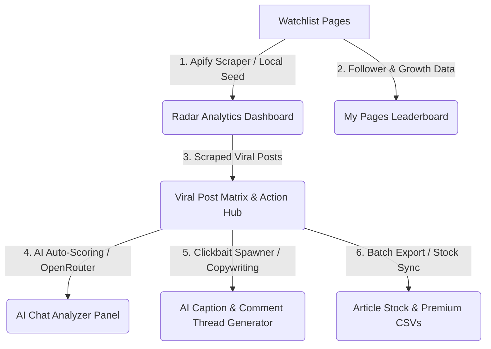

# บทวิเคราะห์และถอดรหัสฟีเจอร์ Competitor Radar (V1)

เอกสารนี้วิเคราะห์การออกแบบ ประสบการณ์ผู้ใช้ (UX/UI) เทคนิคเชิงลึก และสถาปัตยกรรมของโมดูล **Competitor Radar (เรดาร์วิจัยคู่แข่ง)** จากระบบเดิม `BulkVideoCreatorApp-Clean` เพื่อเป็นแม่แบบในการนำคุณลักษณะพิเศษและข้อมูลเพจทั้งหมดมาติดตั้งลงในโปรเจกต์ `ContentFactory` V2

---

## 1. แกนหลักการทำงานและโครงสร้างองค์ประกอบ (Core Pillars)

โมดูล Radar ใน V1 ไม่ได้เป็นเพียงหน้าสแกนข้อมูลธรรมดา แต่เป็น **ระบบวิจัยและแปรสภาพข้อมูล (Data Scraper & Transformation Engine)** แบบครบวงจรที่รวมเอา 4 ส่วนงานมาเชื่อมกันอย่างไร้รอยต่อ:

---

## 2. เจาะลึกความสวยงามและการออกแบบส่วนต่อประสาน (UI/UX Aesthetics)

หน้าจอเรดาร์คู่แข่งของ V1 ถูกออกแบบให้มีลักษณะแบบ **Dashboard ศูนย์บัญชาการ (Control Command Center)** โดยเน้นโทนสีความละเอียดสูง (High-Contrast) บนธีมมืดและสีสันสะท้อนแสงระดับพรีเมียม:

### A. บอร์ดวิเคราะห์เชิงรับ (Radar Analytics Dashboard)
*   **กล่องตัวชี้วัด (Metric Widgets)**: ออกแบบเป็นกล่องแก้วขอบบางมน (`rounded-xl border`) แสดงคะแนนและข้อมูลสรุป:
    *   `🔥 Top Engagement`: แสดงตัวเลขเปอร์เซ็นต์ขนาดใหญ่สีส้มสะท้อนแสง (`text-orange-500`) พร้อมบอกชื่อเพจที่ทำสถิติสูงสุด
    *   `🚀 เติบโตเร็วสุด`: แสดงตัวเลขเติบโตสีเขียวนีออน (`text-green-500`)
    *   `⏱️ เวลาทองคำ`: ตัวเลขเวลาสีฟ้าสว่าง (`text-blue-500`)
*   **แฮชแท็กคลาวด์ (Keyword Cloud)**: การจัดวาง Badge คีย์เวิร์ดมาแรงในรูปทรงเม็ดยาโค้งมน ใช้สีฟ้าใสและขอบจางอย่างสวยงาม (`bg-blue-500/15 text-[#60a5fa] font-semibold`)

### B. หน้าจอเปรียบเทียบอันดับเพจ (`MyPagesRankingDashboard`)
*   **ปักหมุด "เพจของฉัน" (Pinned Own Pages)**:
    *   กรอบบอร์ดใช้สีทองสว่างพิเศษ (`border-[#fbbf24]`) โดดเด่นกว่ากรอบทั่วไป
    *   มีแถบสรุปคะแนนรวมเฉลี่ยของเพจเรา เช่น ผู้ติดตามรวม (สีฟ้า), Engagement เฉลี่ย (สีส้ม), และ Growth รวม (สีเขียว)
    *   มี Badge เหรียญทอง `🥇`, เงิน `🥈`, ทองแดง `🥉` และอันดับเหรียญพิเศษ แสดงความสว่างของความก้าวหน้า
    *   **Inline Editing**: คลิกที่ตัวเลขผู้ติดตามของเพจตัวเองเพื่อแก้ไขในหน้าตารางได้ทันทีโดยไม่ต้องเปิด Modal ถือเป็นความลื่นไหลระดับพรีเมียมของ UX

### C. ปุ่มตารางเฝ้าระวัง (Watchlist Actions)
*   **High Contrast Buttons**: ปุ่มกดสำหรับจัดการรายแถวมีพื้นหลังสีขาวสะท้อนแสง ขอบสีเทาเข้ม ตัวหนังสือหนาสีดำ ให้ความรู้สึกเหมือนหน้าจอควบคุมห้องวิเคราะห์แบบพรีเมียม ตอบสนองเร็วเมื่อเมาส์ชี้ผ่าน (`hover:bg-slate-100 transition-all shadow-sm`)
*   ปริมาณหน้าโพสต์และปุ่ม CSV ถูกจัดเรียงด้วยขนาดและฟอนต์ขนาดเล็กพอดี (`text-[10px] font-black`) เพื่อไม่ให้รกสายตาและคงพื้นที่การอ่านได้มากที่สุด

---

## 3. เจาะลึกโมดูลวิเคราะห์โพสต์ไวรัล (`ViralPostsView`)

นี่คือ **ขุมพลังหลังบ้านที่เป็นจุดต่างที่เด่นที่สุดของ V1** ประกอบด้วยฟีเจอร์ย่อยประสิทธิภาพสูงดังนี้:

### A. ตารางรายการโพสต์ไวรัล (Viral Posts Matrix)
*   ดึงโพสต์ของเพจสแกนทั้งหมดมารวมกันในหน้าเดียว
*   จัดเรียงด้วยคะแนนการมีส่วนร่วมสูงที่สุด (Engagement Score = `Likes + Comments + Shares + Views`) จากมากไปน้อย
*   มีฟิลเตอร์กรองเพจ, แพลตฟอร์ม, หมวดหมู่ และอายุของโพสต์ย้อนหลัง (เช่น 7 วัน, 14 วัน, 30 วัน)
*   แสดงผลแบบแบ่งหน้าสไตล์มินิมอล (`pagination`)

### B. ระบบประเมินเกณฑ์ความดังอัตโนมัติ (AI Batch Auto-Scoring)
*   เชื่อมโยงกับ **OpenRouter API** ทำการดึงแคปชั่นโพสต์ดิบ 10 โพสต์ต่อหนึ่ง Batch ส่งไปประเมินคะแนนทันที
*   ประเมินสองคะแนนสำคัญ:
    1.  `viral_score` (0-10): คะแนนความแรงและกระแสข่าว
    2.  `evergreen_score` (0-10): คะแนนคุณค่าระยะยาวสำหรับแปลงเป็นเนื้อหาอมตะ
*   บันทึกคะแนนลงเซิร์ฟเวอร์แบบถาวรใน `post_scores`

### C. ห้องแชทวิเคราะห์เทรนด์ไอเดิก (AI Trend Chat Analyzer)
*   เป็นแผงควบคุมสไลด์ฝั่งข้างหน้าต่างหลัก
*   มี **Saved Prompt Templates** (คำถามเทมเพลตปักหมุด) เช่น:
    *   *"สรุปเทรนด์หลัก 3-5 อย่างประจำรอบนี้"*
    *   *"ควรทำเนื้อหาสอนเรื่องอะไรจากเทรนด์ตอนนี้?"*
    *   *"โพสต์รูปแบบไหนที่เวิร์คที่สุด (ภาพ/คลิปสั้น/ยาว)?"*
*   ส่งรายชื่อโพสต์ไวรัลที่ผ่านตัวกรองทั้งหมดไปให้ AI อ่าน และสามารถแชทคุยต่อกับโมเดลอย่างลื่นไหล

### D. แคปชั่นคลิกเบตสร้างสรรค์ & คอมเมนต์เปิดประเด็น (Clickbait Captions Generator)
*   สกัดและผลิตแคปชั่นสำหรับนำไปโพสต์เพจเราทันทีได้ถึง 3 โทนที่ผู้ใช้นิยมสูงสุด:
    1.  **ทำทรงเขียนเอง (Self-Write)**: แปลงข่าวโดยลบชื่อคู่แข่งออก เขียนเหมือนไปวิจัยมาเองแต่รักษาความไวรัลของเนื้อหา
    2.  **Clickbait จัดเต็ม**: ดึงดูดความสนใจขั้นสูงสุด ใช้คำเร้าใจ อีโมจิ Urgency และข้อความ FOMO
    3.  **แชร์ข่าวแบบเพื่อน (Casual)**: เป็นกันเอง เล่าให้ฟัง สนุกสนาน
*   **Thread Comments**: นอกเหนือจากแคปชั่น AI จะร่างข้อความสำหรับลงใต้เม้นท์ต่อกัน 3 ส่วน (1/3, 2/3, 3/3) เพื่อสร้างยอดคอมเมนต์ต่อเนื่อง
*   **Admin Note**: เขียนโน้ตแนะแนวทางว่าบอทรูปภาพควรวาดภาพสไตล์ไหนประกอบคอนเทนต์นี้

### E. ส่งออกรายงานความละเอียดสูง (CSV Export with AI Course Valuation)
*   การส่งออกแบบปกติ: สร้างรายงานความแรงของคู่แข่งรายวัน
*   **ส่งออกด้วย AI (AI-Enriched Export)**: AI จะวิเคราะห์โพสต์ทีละชุดเพื่อประเมิน:
    *   `course_score`: โพสต์นี้เหมาะจะแปรสภาพไปทำเป็น **คอร์สออนไลน์สำหรับขาย** หรือไม่ และระบุไอเดียคอร์สเรียนสั้นๆ
    *   `selling_styles`: ประเมินรูปแบบจิตวิทยาการขาย เช่น *The Value Provider* (ให้ความรู้เน้น Pain Point) หรือ *The FOMO Creator* (เล่นกับจำนวนจำกัดและเวลา)

---

## 4. แผนงานย้ายข้อมูลเพจและยกระดับ V2 ContentFactory

เพื่อให้ระบบ V2 มั่นคง แข็งแกร่ง และรองรับทุกคุณสมบัติพรีเมียมจาก V1 อย่างสมบูรณ์แบบ เราจะเชื่อมต่อข้อมูลจาก V1 และติดตั้ง **บอร์ด Radar อเนกประสงค์** ลงในตาราง Vault V2 ดังต่อไปนี้:

### A. ข้อมูลเพจที่ดึงมาจาก V1 และนำเข้า V2 ครบ 41 เพจ
ข้อมูลเพจทั้งหมดที่รวบรวมมาจากประวัติค้นหาใน V1 ได้รับการบันทึกลงใน SQLite ของ V2 ตาราง `competitors` และไฟล์ `seed_watchlist.json` แล้ว พร้อมรายละเอียดครบถ้วน:

1.  **TechFeed Thailand** (ข่าวไอทีหลัก ดึงไวรัลโพสต์ดีไซน์พรีเมียม) - *Followers: 185,000*
2.  **AI Update** (อัปเดตเครื่องมือ AI ตัวใหม่ๆ นวัตกรรมโลก) - *Followers: 48,000*
3.  **Blognone** (ข่าวสารและบทความสำหรับนักพัฒนาโปรแกรม) - *Followers: 290,000*
4.  **และเพจชั้นนำอื่นๆ อีก 38 เพจ** ในหมวดรีวิว, สอน AI, การเงิน/ลงทุน, ธุรกิจ/การตลาด

### B. แนวทางเชื่อมโยงฟีเจอร์ระดับพรีเมียมเข้ากับห้อง Canvas V2
*   รายการโพสต์จาก 41 เพจนี้สามารถกดปุ่ม **"อนุมัติเพื่อวาดรูปโพสต์" (Approve for Design)** หรือเปิดฟีเจอร์ **"แสดงวัตถุดิบทั้งหมด"** ในหน้า Canvas V2
*   หัวข้อข่าวที่ AI หรือคุณคัดเกลาในแท็บ Canvas จะสอดคล้องกับพาดหัวข่าว Clickbait ของ V1
*   ภาพ Keyframes หรือ backdrop จากคลิปคู่แข่งที่ถูกดักสกัดโดยระบบความมั่นคง V2 จะถูก Pillow นำไปเรนเดอร์จัดกึ่งกลางและไฮไลต์คีย์เวิร์ดสีนีออนอย่างสวยงามทันที!
