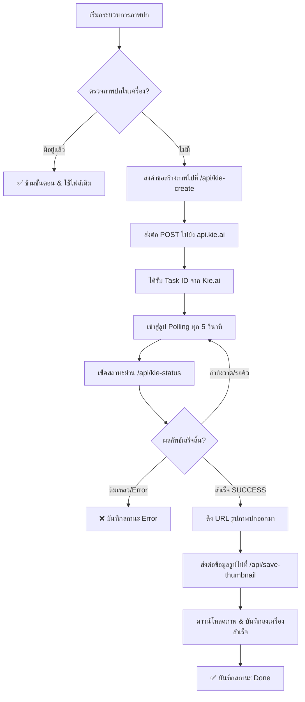

# 🎞️ เอกสารวิเคราะห์ระบบ "ทำคลิปStock" (Automated Stock Clip Creator)

เอกสารฉบับนี้วิเคราะห์เชิงลึกเกี่ยวกับโครงสร้าง ระบบการทำงาน คีย์เทคโนโลยี และสถาปัตยกรรมของโมดูล **ทำคลิปStock (Stock Clip Maker)** ซึ่งพัฒนาขึ้นในโปรเจกต์ `BulkVideoCreatorApp-Clean` เพื่อทำหน้าที่สร้างวิดีโอสั้นอัตโนมัติ โดยสุ่มตัดต่อวิดีโอจากโฟลเดอร์ฟุตเทจต้นทางให้มีความยาวพอดีเป๊ะกับไฟล์เสียง พร้อมทั้งรวมเสียง และสร้างภาพปกด้วย AI (Kie.ai)

---

## 📌 1. ภาพรวมระบบ (System Overview)

โมดูล **"ทำคลิปStock"** ได้รับการออกแบบมาเพื่อแก้ปัญหาการตัดต่อวิดีโอจำนวนมากสำหรับสร้างคอนเทนต์ลงบนแพลตฟอร์มต่าง ๆ (เช่น YouTube Shorts, TikTok, Facebook Reels) โดยทำงานร่วมกันในลักษณะ **Batch Processing** และ **Deduplication Mode (ลดการทำงานซ้ำ)**

### ความสามารถหลัก:
1. **FOOTAGE RANDOMIZER & ALIGNMENT**: ค้นหาไฟล์วิดีโอ (.mp4, .mov ฯลฯ) ในโฟลเดอร์ต้นทางแบบลงลึกทุกโฟลเดอร์ย่อย (Recursive Scan) สุ่มเลือกและนำมาตัดต่อเรียงต่อกันให้ได้ความยาวพอดีกับไฟล์เสียงนำเข้า (พร้อมเผื่อความยาวเพิ่ม +1.0 วินาทีเพื่อให้ตัดจบสวยงาม)
2. **SMART DEDUPLICATION**: ตรวจสอบไฟล์ปลายทางก่อนเสมอว่ามีวิดีโอหรือรูปปกชื่อเดิมที่เคยเรนเดอร์สำเร็จอยู่แล้วหรือไม่ หากมีจะข้ามการประมวลผลทันทีเพื่อประหยัดทรัพยากรเครื่องและค่าใช้จ่าย API
3. **AI THUMBNAIL GENERATOR**: เชื่อมต่อ API ของ `Kie.ai` ผ่านโมเดล `gpt-image-2-text-to-image` เพื่อใช้วาดภาพปกวิดีโอด้วย AI ตามหัวข้อ (ดึงจากชื่อไฟล์เสียงอัตโนมัติ) และบันทึกลงโฟลเดอร์ปลายทาง
4. **INTEGRATED PROCESS CONTROLS**: สามารถสั่งงานให้หยุดทำงานชั่วคราว (Pause), ทำงานต่อ (Resume), หรือยกเลิกงานทั้งหมด (Stop) ระหว่างการเรนเดอร์ได้แบบ Real-time ด้วยสตรีมข้อมูลแบบ Server-Sent Events (SSE) และการใช้ OS Signals (`SIGSTOP`, `SIGCONT`, `SIGKILL`)

---

## 🛠️ 2. สถาปัตยกรรมหน้าบ้าน (Frontend UI Architecture)

โค้ดในหน้าบ้านถูกเขียนขึ้นในไฟล์: `src/components/stock/StockClipTab.tsx`

### โครงสร้าง UI และ State Management ที่สำคัญ:
* **Folder Selection States**:
  * `sourceFolder`: โฟลเดอร์ที่จัดเก็บคลิปวิดีโอฟุตเทจดิบ
  * `audioFolder`: โฟลเดอร์ที่จัดเก็บไฟล์เสียงพากย์ (.mp3, .wav, .m4a, .aac, .ogg, .flac)
  * `outputFolder`: โฟลเดอร์ปลายทางที่ต้องการเก็บวิดีโอและรูปปกสำเร็จรูป
* **Process Tracking States**:
  * `audioFiles`: รายชื่อไฟล์เสียงที่สแกนเจอในโฟลเดอร์
  * `outputClips`: อาเรย์อ็อบเจกต์เก็บสถานะการเรนเดอร์ของไฟล์แต่ละตัว เช่น `status` (`pending`, `analyzing`, `rendering`, `done`, `error`, `paused`) และ `thumbStatus` (`pending`, `generating`, `done`, `error`, `skipped`)
  * `progress`: เปอร์เซ็นต์ความคืบหน้าภาพรวม (0-100%)
  * `logs`: อาเรย์เก็บประวัติการบันทึกสถานะการทำงาน (Console Logs) เพื่อแสดงผลในกล่องสีดำสไตล์ Terminal ในหน้าเว็บ
* **AI Configuration States**:
  * `enableThumbnail`: เปิด/ปิดตัวเลือกการสร้างปกคลิปอัตโนมัติด้วย AI
  * `thumbPromptTemplate`: เทมเพลต Prompt สำหรับส่งไปให้ AI วาดรูปปก โดยจะมีการนำ `{TOPIC}` มาแทนที่ด้วยหัวข้อจริง

### ฟังก์ชันการทำงานที่สำคัญหน้าบ้าน:
1. **การดึง Folder ผ่าน API โฮสต์ภายนอก**:
   เรียก `/api/pick-folder` เพื่อเปิดไดอะล็อกเลือกระบบโฟลเดอร์ของ macOS/Windows แล้วนำผลลัพธ์พาทมาเก็บบน React State
2. **การวาดภาพปกเดี่ยว (Individual Thumbnail Generation)**:
   ผู้ใช้สามารถกดปุ่มรูปไอคอนรูปภาพในคอลัมน์ปกของแต่ละแถวในตารางเพื่อวาดเฉพาะภาพปกสำหรับไฟล์เสียงนั้นๆ ได้ทันทีโดยไม่ต้องรันวิดีโอใหม่
3. **การทำงานร่วมกันแบบ Smart Batch (`startBatchAllJobs`)**:
   เป็นโหมดการทำงานที่จะช่วยเก็บตกไฟล์ที่ผิดพลาด โดยแบ่งการทำงานออกเป็น 2 เฟสหลักแบบเรียงลำดับ:
   * **Phase 1: Generate missing thumbnails first**: วนลูปวาดปกคลิปทั้งหมดด้วย AI ก่อน (ข้ามตัวที่มีอยู่แล้ว)
   * **Phase 2: Render missing videos next**: วนลูปตัดต่อวิดีโอทั้งหมดด้วยระบบ FFmpeg (ข้ามตัวที่มีวิดีโออยู่แล้วเช่นกัน)
4. **การยกเลิกกระบวนการ (Abort Signals)**:
   ใช้ `AbortController` ร่วมกับ `abortRef` เพื่อส่งสัญญาณสั่งยกเลิก Fetch Request ไปยัง Back-end ได้ทันทีเมื่อผู้ใช้กดปุ่ม [หยุด]

---

## ⚙️ 3. สถาปัตยกรรมหลังบ้าน (Backend API & Middleware Architecture)

ระบบหลังบ้านเขียนอยู่ในรูปแบบของ **Vite Server Middleware** ภายในไฟล์ `vite.config.ts` ทำให้สามารถรันร่วมกับเซิร์ฟเวอร์พัฒนาได้โดยตรง ไม่ต้องเปิดเซิร์ฟเวอร์ API แยกต่างหาก

### ตาราง APIs ที่เกี่ยวข้อง:

| Endpoint | Method | คำอธิบาย |
| :--- | :--- | :--- |
| `/api/list-audio-files` | `POST` | สแกนหาไฟล์เสียงในโฟลเดอร์ที่เลือก โดยรองรับสกุลไฟล์ `.mp3`, `.wav`, `.m4a`, `.aac`, `.ogg`, `.flac` |
| `/api/check-file-exists` | `POST` | ตรวจสอบว่ามีไฟล์ปลายทางอยู่แล้วบนเครื่องหรือไม่ (ใช้เช็คการข้ามงานซ้ำ) |
| `/api/open-folder` | `GET` | ใช้คำสั่ง Shell `open "[folderPath]"` เพื่อเปิดโฟลเดอร์ปลายทางด้วย Finder บน macOS |
| `/api/render-stockclip-audio` | `POST` | เอนจินตัดต่อหลัก: ทำการสแกนฟุตเทจ, สุ่มเลือก, และสตรีมมิ่งความคืบหน้าการเขียนไฟล์วิดีโอแบบ SSE |
| `/api/stockclip-pause` | `POST` | สั่งส่งสัญญาณ `SIGSTOP` ไปยังโปรเซส FFmpeg |
| `/api/stockclip-resume` | `POST` | สั่งส่งสัญญาณ `SIGCONT` ไปยังโปรเซส FFmpeg |
| `/api/stockclip-stop` | `POST` | สั่งส่งสัญญาณ `SIGKILL` ไปยังโปรเซส FFmpeg และเคลียร์ค่าสตรีมทั้งหมด |
| `/api/kie-create` | `POST` | พร็อกซี CORS เพื่อสร้าง Task ไปยังบริการ Kie.ai (`api.kie.ai/api/v1/jobs/createTask`) |
| `/api/kie-status` | `GET` | พร็อกซีเพื่อตรวจสอบสถานะของรูปภาพปกที่ส่งวาด (`api.kie.ai/api/v1/jobs/recordInfo`) |
| `/api/save-thumbnail` | `POST` | ดาวน์โหลดรูปภาพปกจาก CDN ของ Kie.ai และนำมาเขียนบันทึกลงในไดรฟ์เครื่อง |

---

## 🎬 4. อัลกอริทึมการสุ่มและผสานวิดีโอด้วย FFmpeg

นี่คือหัวใจสำคัญของการทำงานในระบบ โดยทำงานอยู่ในส่วน API `/api/render-stockclip-audio` มีรายละเอียดขั้นตอนการประมวลผลดังนี้:

### ขั้นตอนที่ 1: ค้นหาไฟล์วิดีโอแบบ Recursive Scan
ระบบจะไล่ดูทุกโฟลเดอร์และโฟลเดอร์ย่อยในพาท `sourceFolder` เพื่อดึงไฟล์ที่มีสกุล `.mp4`, `.mov`, `.avi`, `.mkv`, `.m4v`, `.webm` มารวมกันในอาร์เรย์ `allVideos`

### ขั้นตอนที่ 2: อ่านความยาวของไฟล์เสียงพากย์
ระบบจะใช้คำสั่งผ่าน **FFprobe** ในการอ่านเวลาจริงเป็นทศนิยมวินาที:
```bash
ffprobe -v error -show_entries format=duration -of csv=p=0 "[AUDIO_PATH]"
```
*หากเกิดข้อผิดพลาดในการวิเคราะห์ด้วย FFprobe ระบบจะมีกลไกสำรอง (Fallback) โดยไปรันคำสั่ง **FFmpeg** ดึงเวลาจาก Header Metadata แทน*

### ขั้นตอนที่ 3: ตรวจสอบความยาวของคลิปฟุตเทจทุกตัว
เพื่อความแม่นยำในการคำนวณและเลือกฟุตเทจมาประกอบ ระบบจะรันคำสั่ง FFprobe บนฟุตเทจทุกชิ้นเพื่อสร้างลิสต์ความยาวของแต่ละคลิปเก็บไว้ ชิ้นไหนที่สั้นเกิน 0.5 วินาทีจะถูกข้ามไป

### ขั้นตอนที่ 4: สุ่มหยิบฟุตเทจเติมจนเต็มเวลาเสียง (Footage Randomizing)
ระบบจะสุ่มหยิบฟุตเทจวนไปเรื่อย ๆ จนกว่าความยาวรวมของฟุตเทจจะมากกว่าหรือเท่ากับความยาวเสียงจริงบวกเพิ่มอีก 1.0 วินาที (`targetDuration = audioDuration + 1.0`)
> [!NOTE]
> หากจำนวนไฟล์ฟุตเทจที่เตรียมไว้มีน้อยเกินไป ระบบจะสุ่มหยิบไฟล์เดิมซ้ำได้โดยอัตโนมัติ (พร้อมล็อกจำนวนรอบป้องกันการวนลูปไม่รู้จบ) เพื่อให้มั่นใจว่าความยาวของวิดีโอจะมีภาพเล่นจบพร้อมเสียงเสมอ

### ขั้นตอนที่ 5: ตรวจจับมิติวิดีโอต้นแบบ (Width & Height Detection)
ระบบจะวิเคราะห์ความกว้างและสูงจากฟุตเทจไฟล์แรกในลิสต์สุ่มเพื่อใช้อ้างอิงการจัดสัดส่วนของวิดีโอทั้งหมด ป้องกันไม่ให้วิดีโอเกิดอาการบีบอัด สัดส่วนเสีย หรือเกิดพิกเซลเพี้ยน (โดยระบบจะบังคับแปลงตัวเลขเป็นเลขคู่เสมอก่อนใช้งาน)

### ขั้นตอนที่ 6: สร้างไฟล์ควบคุมการผสาน (Concat List)
ระบบจะแปลงพาทฟุตเทจที่สุ่มได้ทั้งหมดมาจัดทำเป็นไฟล์ชั่วคราว เช่น `stockclip_concat_1716892911.txt` ในลักษณะ:
```text
file '/path/to/video1.mp4'
file '/path/to/video2.mp4'
file '/path/to/video3.mp4'
```

### ขั้นตอนที่ 7: ดำเนินการตัดต่อและประมวลผลด้วย FFmpeg
ระบบจะสั่งรันคำสั่ง FFmpeg ในลักษณะ Child Process ของ Node.js ดังนี้:

```bash
ffmpeg -y -f concat -safe 0 -i "[LIST_PATH]" -i "[AUDIO_PATH]" \
-map 0:v:0 -map 1:a:0 \
-vf "scale=[WIDTH]:[HEIGHT]:force_original_aspect_ratio=increase,crop=[WIDTH]:[HEIGHT],setsar=1" \
-c:v libx264 -preset fast -crf 22 -r 24 -pix_fmt yuv420p \
-c:a aac -b:a 128k -shortest "[OUTPUT_PATH]"
```

#### 💡 วิเคราะห์พารามิเตอร์ของ FFmpeg:
* `-f concat -safe 0 -i "[LIST_PATH]"`: นำเข้าวิดีโอฟุตเทจทั้งหมดตามลำดับที่เขียนในไฟล์ควบคุม
* `-i "[AUDIO_PATH]"`: นำเข้าไฟล์เสียงพากย์หลัก
* `-map 0:v:0`: ดึงเฉพาะช่องสัญญาณภาพ (Video Stream) จากอินพุตที่ 1 (วิดีโอฟุตเทจ)
* `-map 1:a:0`: ดึงเฉพาะช่องสัญญาณเสียง (Audio Stream) จากอินพุตที่ 2 (ไฟล์เสียงพากย์)
* `-vf "scale=...force_original_aspect_ratio=increase,crop=..."`: ฟิลเตอร์อัจฉริยะที่จะขยายขนาดคลิปวิดีโอแบบรักษาสัดส่วนดั้งเดิม (Aspect Ratio) ให้ครอบคลุมความกว้างและสูงที่กำหนดไว้ แล้วทำการตัดขอบส่วนเกินออก (Cropping) ช่วยให้คลิปปลายทางดูสวยงามไร้ขอบดำ
* `-c:v libx264 -preset fast -crf 22`: เข้ารหัสภาพด้วย Codec H.264 ด้วยความเร็วระดับ Fast โดยใช้ดัชนีคุณภาพ CRF ที่ 22 (ให้ภาพคมชัดระดับสูงในขณะที่ขนาดไฟล์ไม่ใหญ่จนเกินไป)
* `-shortest`: **หัวใจสำคัญของการตรงเวลา** คำสั่งนี้จะบอกให้ FFmpeg หยุดเข้ารหัสและบันทึกไฟล์วิดีโอทันทีที่ไฟล์ที่มีความยาวสั้นที่สุดจบลง ซึ่งก็คือ **ไฟล์เสียงพากย์** ทำให้มั่นใจได้ว่าวิดีโอเอาต์พุตจะหยุดลง ณ วินาทีสุดท้ายของเสียงพากย์พอดีเป๊ะ

---

## 🎨 5. ระบบสร้างภาพปกอัตโนมัติด้วย AI (Kie.ai Integration)

เมื่อเปิดใช้งาน `enableThumbnail` ระบบจะมีขั้นตอนการวาดปกตามลำดับการทำงานนี้:



### รายละเอียดการเรียกบริการ Kie.ai:
* **โมเดลใช้งาน**: `gpt-image-2-text-to-image`
* **ตัวแปรอินพุต**:
  * `prompt`: ข้อความบรรยายภาพ โดยจะเปลี่ยนคำว่า `{TOPIC}` ด้วยชื่อไฟล์เสียงเปล่าๆ (ตัดนามสกุลออก)
  * `aspect_ratio`: `'16:9'` (สัดส่วนภาพปกมาตรฐาน)
  * `num_inference_steps`: `20` (ความละเอียดภาพ)
* **กลไกการดาวน์โหลดและแก้ไข Redirect**:
  เนื่องจาก URL รูปภาพที่ได้จาก AI มักจะถูกเก็บไว้บน Object Storage (เช่น AWS S3 หรือ Tencent Cloud COS) ซึ่งมักส่ง Header แบบ Redirect (301/302) ทาง API หลังบ้านจึงมีการเขียนฟังก์ชันการติดตามลิงก์อัตโนมัติ (`Follow Redirects`) เพื่อให้แน่ใจว่าจะดาวน์โหลดไฟล์ภาพดิบมาบันทึกลงในเครื่องได้อย่างสมบูรณ์แบบโดยตรง

---

## 🚀 6. การสรุปคุณค่าและการนำไปปรับใช้ใน ContentFactory V2

ระบบ "ทำคลิปStock" จากโปรเจกต์เดิมนี้มีคุณค่าสูงมากและสามารถถอดสเปกไปใช้งานใน V2 ได้ทันทีเนื่องจาก:
1. **โค้ดเขียนไว้อย่างเป็นระเบียบ**: UI แยกสัดส่วนชัดเจน การเขียน Logic เชื่อมต่อ SSE ฝั่ง React ค่อนข้างสมบูรณ์แบบ
2. **มีระบบควบคุม FFmpeg แบบละเอียดยิบ**: การใช้งาน Signals (`SIGSTOP`, `SIGCONT`, `SIGKILL`) ร่วมกับ Event Stream (SSE) ช่วยยกระดับ UX ให้ผู้ใช้รู้สึกควบคุมกระบวนการเรนเดอร์ที่มีความยาวนานได้ตลอดเวลา
3. **ลดปัญหาเสียง/ภาพไม่ตรงกัน**: การใช้วิธี Concat ภาพฟุตเทจสุ่มนำหน้าแล้วปิดด้วยอาร์กิวเมนต์ `-shortest` ร่วมกับไฟล์เสียงนำเข้าช่วยป้องกันบั๊กภาพค้าง ภาพดำ หรือภาพสั้นกว่าเสียงได้อย่างเด็ดขาด
4. **ความคุ้มค่าและความประหยัด**: การเช็คการข้ามงานซ้ำด้วย `/api/check-file-exists` ช่วยป้องกันไม่ให้เสียโควตา Kie.ai API และลดความร้อนสะสมของการ์ดจอในการรัน FFmpeg ซ้ำโดยไร้ประโยชน์
