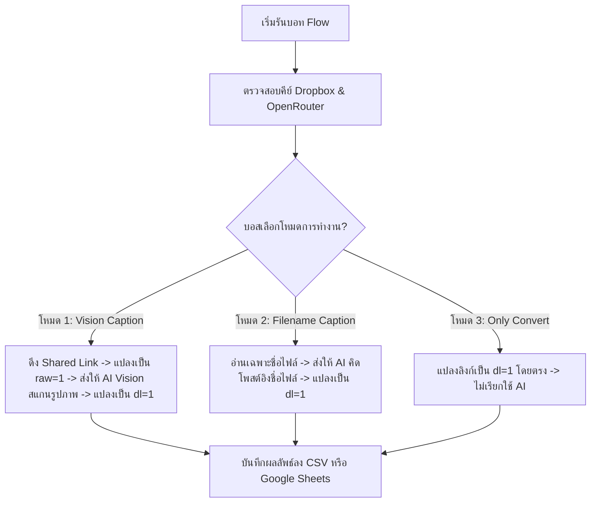

# 🚀 รายงานการวิเคราะห์ขีดความสามารถ: บอท Flow - Workflow Automator V2
> **แหล่งข้อมูล:** ส่วนประกอบ `FlowAutomatorPortal.tsx` จากโครงการ **ContentFactory**

**Workflow Automator V2** (บอท Flow รุ่นอัปเกรด) คือระบบอัตโนมัติอัจฉริยะแบบ Client-Side (ทำงานโดยตรงบนเว็บเบราว์เซอร์ของผู้ใช้) ที่เชื่อมต่อการทำงานของ **Dropbox → OpenRouter AI (Gemini 2.5) → Google Sheets / CSV** ระบบได้รับการปรับปรุงขยายขีดความสามารถให้ยืดหยุ่น ปลอดภัย และฉลาดขึ้นอย่างก้าวกระโดดด้วยตัวเลือกโหมดการผลิต คลังสมองจูนสำนวนการเขียน และตัวเช็คสถานะการเชื่อมต่อ API แบบเรียลไทม์

---

## 📂 1. สถาปัตยกรรมและเทคโนโลยีที่ใช้ (Architecture & Tech Stack)

ระบบนี้ถูกพัฒนาขึ้นด้วย **React + TypeScript** ในไฟล์ [FlowAutomatorPortal.tsx](file:///Users/paulpolsulintaboon/Documents/GitHub/ContentFactory/frontend/src/components/FlowAutomatorPortal.tsx) เชื่อมโยงเทคโนโลยีต่างๆ ดังนี้:

*   **Frontend Interface:** พัฒนาด้วย React Hooks (`useState`, `useEffect`, `useRef`) ร่วมกับระบบแท็บแบบไดนามิกและการควบคุมสถานะแบบอะซิงโครนัส (Asynchronous states)
*   **Dropbox API v2:** ดึงข้อมูลโฟลเดอร์ ลิสต์ไฟล์ จัดการสร้าง Shared Link และแปลงลิงก์ในรูปแบบด่วน
*   **OpenRouter API (Gemini 2.5 Flash):** โมเดลหลักในการถอดถอนข้อมูล ถอดรูปภาพ (Vision Mode) สร้างคำคม เขียนแคปชั่นขายของ และทำหน้าที่เป็น Prompt Engineer เพื่อขัดเกลา System Prompt ในคลังสมอง
*   **Google Sheets API v4:** ต่ออายุและบันทึกข้อมูลแบบเรียลไทม์ออนไลน์ผ่าน OAuth 2.0 (Redirect Flow)
*   **Local Storage Sync:** บันทึกสำนวนจูนสมองในคีย์ `system_prompts_brain` และสถานะโหมดต่างๆ ทำให้ข้อมูลไม่สูญหายเมื่อรีเฟรชเบราว์เซอร์

---

## ⚡ 2. ขีดความสามารถและฟีเจอร์หลัก V2 (Core Capabilities & Features)

### 2.1 แถบตรวจสอบสถานะ API เรียลไทม์ (API Status Checker Bar)
บอท Flow มีระบบตรวจสอบสิทธิ์และสถานะการเชื่อมโยงเครือข่ายของ API อัตโนมัติ (และมีปุ่มให้กดทดสอบใหม่แบบ Manual):
*   **Dropbox API Connection Check:** เรียกตรวจสอบผ่าน endpoint `https://api.dropboxapi.com/2/users/get_current_account` ส่งคีย์แบบ Header Bearer เพื่อยืนยันว่า Access Token ใช้การได้จริง
*   **OpenRouter API Connection Check:** เรียกตรวจสอบผ่าน endpoint `https://openrouter.ai/api/v1/auth/key` เพื่อเช็คว่า API Key ถูกต้องและเปิดใช้งานอยู่
*   **Visual Indicators:** แสดงไฟสถานะ 🟢 เชื่อมต่อแล้ว, 🔴 ยังไม่เชื่อมต่อ หรือ 🌀 กำลังเช็ค... เพิ่มความมั่นใจให้ผู้ใช้งานก่อนปล่อยบอทรัน Pipeline ยาวๆ

---

### 2.2 โหมดการทำงาน 3 รูปแบบให้เลือกสรร (3 Flexible Operation Modes)
บอสสามารถเลือกโหมดการผลิตให้สอดคล้องกับปริมาณงานและทรัพยากรโทเคนได้ 3 รูปแบบ:

#### 📸 โหมด 1: AI ดูรูปภาพ Dropbox (Vision Mode + Link Conversion)
*   เหมาะสำหรับรูปภาพสินค้าสต็อกดิบที่ชื่อไฟล์ไม่มีรายละเอียด ระบบจะดึง Shared Link ของ Dropbox และแปลงเป็นลิงก์ภาพดิบ (`raw=1`) ส่งตรงเข้า Gemini Vision API ผนวกกับ **System Prompt (สมองของ AI)** เพื่อสแกนองค์ประกอบในรูปภาพจริง แล้วเขียนคำบรรยาย/แคปชั่นสไตล์ Micro-Content ดึงดูดลูกค้าได้อย่างมีมิติ
*   สำหรับไฟล์วิดีโอ ระบบจะสลับไปเขียนคำบรรยายอิงตามชื่อไฟล์ให้อัตโนมัติเพื่อเลี่ยง Rate Limit

#### ✍️ โหมด 2: AI เขียนแคปชั่นอิงตามชื่อไฟล์ (Text Mode + Link Conversion)
*   เหมาะสำหรับงานที่ชื่อไฟล์มีข้อมูลสินค้าชัดเจนอยู่แล้ว (เช่น `สร้อยหยกเขียวพม่าดิบ_590บาท.jpg`) ระบบจะไม่โหลดรูปภาพไปให้ AI สแกน แต่จะส่งชื่อไฟล์ไปให้ AI เขียนแคปชั่นขายของหรือคำคมให้ทันที ช่วยประหยัดเวลาการทำงาน และประหยัดค่าโทเคนได้มากกว่าเดิม 3-5 เท่า

#### 🔗 โหมด 3: แปลงลิงก์ด่วน `dl=1` อย่างเดียว (Pure Link Conversion Mode)
*   เหมาะสำหรับบอสที่ต้องการแปลงลิงก์แชร์ของ Dropbox ทั่วไปให้กลายเป็นลิงก์ดาวน์โหลดตรงปลายทาง (`dl=1`) เพื่อให้ทีมงานดาวน์โหลดไปยิงแอดหรือใช้งานต่อได้อย่างรวดเร็ว
*   **จุดเด่น:** โหมดนี้ **ไม่ต้องใช้ระบบ AI และไม่ต้องใส่ OpenRouter API Key** ทำงานได้เร็วที่สุดระดับเสี้ยววินาทีต่อไฟล์ และไม่เสียค่าบริการโทเคนใดๆ ทั้งสิ้น ช่องผลลัพธ์แคปชั่นจะถูกเว้นเป็นเครื่องหมาย `"-"` ไว้อย่างสวยงาม

---

### 2.3 ระบบคลังสมองและจูนสำนวนการเขียน (AI Brain Custom Tuning Suite)
นี่คือฟีเจอร์ระดับพรีเมียมที่ถูกสร้างมาเพื่อควบคุมสำนวน ทนเสียง และโครงสร้างให้เป็นเอกลักษณ์เฉพาะเพจ โดยแบ่งส่วนอินเตอร์เฟสออกเป็น 3 แท็บย่อยเพื่อความสะดวกสูงสุด:

#### 1. แท็บ 🧠 แก้ไขสมอง (Prompt Editor)
*   พื้นที่สำหรับดูและปรับเปลี่ยนตัว **System Prompt (สมองของ AI)** ปัจจุบันได้แบบเรียลไทม์
*   มีเมนูเลือกโหลดชุดสมองที่บันทึกไว้ในเบราว์เซอร์ พร้อมปุ่มลบสมองที่ไม่ใช้แล้ว
*   มีปุ่ม **"💾 เซฟเป็นสมองใหม่"** เพื่อให้บอสบันทึกไอเดียพร้อมตั้งชื่อชุดสมองเก็บแยกหมวดหมู่ได้ เช่น สมองเพจหยก, สมองเพจความรู้, สมองเพจคำคม

#### 2. แท็บ 📁 สกัดสำนวน .TXT (TXT Style Analyzer)
*   บอสสามารถแนบไฟล์ `.txt` ที่รวบรวมตัวอย่างแคปชั่นหรือโพสต์ที่เคยเขียนและมีคนไลก์เยอะๆ ระบบ AI จะทำการสแกนไฟล์เพื่อวิเคราะห์และสกัดโครงสร้าง (Hook, สเปกสินค้า, ราคา, CTA, โทนเสียง, กฎเหล็ก)
*   จากนั้นแปลงออกมาเป็น AI System Prompt ภาษาไทยที่สมบูรณ์แบบให้อัตโนมัติ พร้อมบันทึกเก็บเป็นสมองใหม่ลงคลังได้ทันทีโดยไม่ต้องเขียน Prompt เอง!

#### 3. แท็บ 🧪 จูน & ทดลองสร้าง (Live Tuner & Prompt Refiner)
*   **Live Preview (ทดลองสร้าง):** บอสสามารถใส่ชื่อสินค้าหรือหัวข้อทดสอบ (เช่น "สร้อยหยกขาวแกะสลัก") แล้วกดปุ่มทดลองสร้าง AI จะทำการดึงผลลัพธ์ที่ได้จากการรันสมองปัจจุบันมาแสดงผลให้ดูเป็นตัวอย่างแบบเรียลไทม์
*   **Tuning Suggestions (แนะนำแก้ไข):** หากข้อความทดลองสร้างยังไม่ตรงใจ บอสสามารถพิมพ์ฟีดแบ็กแนะนำในช่องคำสั่งจูนเพิ่ม (เช่น *"ขอให้สั้นลงอีก กระชับๆ และใส่อีโมจิดาวสีเขียวท้าย Hook"* หรือ *"ลดความเป็นทางการลง"* )
*   **Prompt Refiner Loop:** ระบบจะส่งฟีดแบ็กนี้กลับไปให้ AI ทำการ **Refine (เขียนและปรับปรุงโครงสร้างคำสั่งสมอง)** ออกมาใหม่แบบไดนามิก และทำการทดลองสร้างผลลัพธ์ชิ้นใหม่มาให้บอสตรวจซ้ำทันทีจนกว่าจะพอใจสูงสุด!

---

## 🆚 3. ตารางเปรียบเทียบโหมดการทำงาน V2

| คุณลักษณะ | 📸 โหมด 1: Vision Caption | ✍️ โหมด 2: Filename Caption | 🔗 โหมด 3: Only Convert |
| :--- | :--- | :--- | :--- |
| **การประมวลผลรูปภาพ** | **มี (Vision Mode)** สแกนภาพจริง | **ไม่มี** สแกนเฉพาะชื่อไฟล์ | **ไม่มี** ไม่สนใจรูปและไฟล์ |
| **ความยืดหยุ่นในการเขียน** | **สูงที่สุด** อิงจากรูปภาพและข้อความ | **ปานกลาง** อิงตามคีย์เวิร์ดบนชื่อไฟล์ | **ไม่มี** แปลงลิงก์ด่วนอย่างเดียว |
| **การใช้ OpenRouter API Key** | **จำเป็น** | **จำเป็น** | **ไม่จำเป็น** (รันได้แม้ไม่มีคีย์ AI) |
| **การใช้ Dropbox Access Token** | **จำเป็น** | **จำเป็น** | **จำเป็น** |
| **ความเร็วในการทำงาน** | ปานกลาง (หน่วง 3วิ ป้องกัน Limit) | รวดเร็ว (หน่วง 3วิ ป้องกัน Limit) | รวดเร็วที่สุด (แปลงลิงก์ทันที) |
| **ปริมาณโทเคนปลายทาง** | ปานกลาง-สูง (ประมวลผลภาพ) | ต่ำและประหยัด | **ศูนย์ (ฟรี 100%)** |

---

## 🛠️ 4. สรุปความคุ้มค่าสำหรับผู้ใช้งาน

**Workflow Automator V2** คืออาวุธการผลิตคอนเทนต์แบบกลุ่ม (Bulk Content Creator) ที่ครบเครื่องที่สุด บอสสามารถดึงคลังรูปภาพและคลิปจากคลาวด์ Dropbox มาแปรรูปเป็นตารางโพสต์สำเร็จรูปที่มีสำนวนโดนใจ มีลิงก์สำหรับทีมงานดาวน์โหลดไปรันงานต่อได้ทันที และควบคุมความปลอดภัยด้วยตัวชี้วัดสถานะ API ก่อนการเริ่มต้นระบบ ปลอดภัย รวดเร็ว และเซฟต้นทุนการจ้างพนักงานเขียนคอนเทนต์หรือจ่ายระบบ Make / n8n รายเดือนได้อย่างถาวร!
